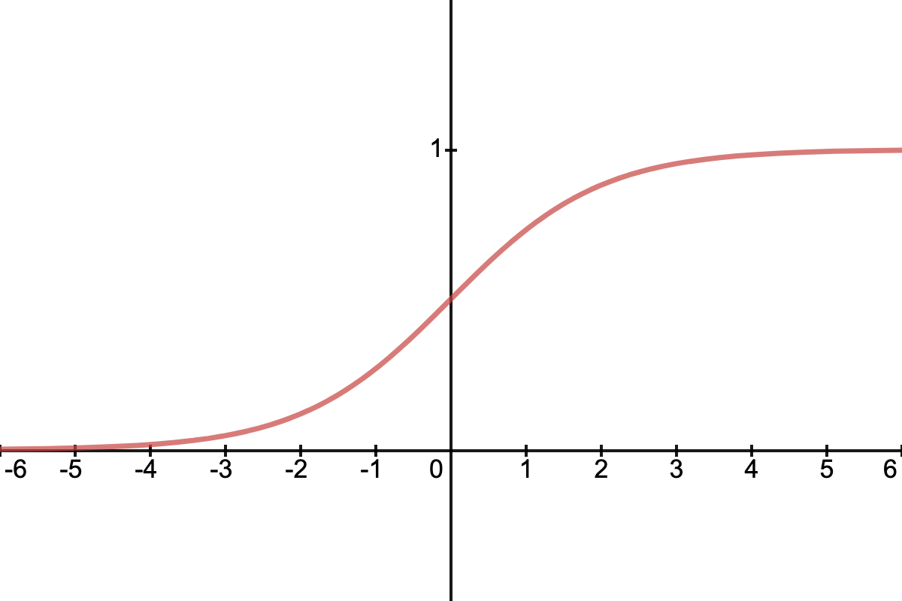

# Machine Learning Notes


## Unit 1: Machine Learning Life Cycle

The Machine Learning (ML) life cycle is a systematic process that guides the development and deployment of machine learning models. It's not a strictly linear path; often, it involves iteration and revisiting earlier stages based on insights gained.

### 1.1 Problem Definition and Data Collection

* **Problem Definition:** Clearly articulate the business or scientific problem you aim to solve using ML. This involves understanding the objective, identifying the target variable (what you want to predict), and defining success metrics.
    * **Example:** Predicting house prices (regression problem), classifying emails as spam or not spam (classification problem).
* **Data Collection:** Gather relevant data that can help solve the defined problem. This data should ideally be representative of the real-world scenarios the model will encounter.
    * **Sources:** Databases, APIs, public datasets, web scraping, surveys.

### 1.2 Data Preprocessing and Cleaning

Raw data is rarely in a usable format for ML models. This stage focuses on transforming it into a clean, consistent, and structured format.

* **Handling Missing Values:**
    * **Imputation:** Filling in missing values using strategies like mean, median, mode, or more advanced methods (e.g., K-Nearest Neighbors imputation).
    * **Deletion:** Removing rows or columns with too many missing values (use cautiously to avoid losing valuable data).
* **Handling Outliers:**
    * **Identification:** Detecting extreme data points that deviate significantly from the rest of the data (e.g., using Z-score, IQR method).
    * **Treatment:** Removing, transforming (e.g., log transformation), or capping/flooring outliers.
* **Data Transformation:**
    * **Scaling (Feature Scaling):** Bringing features to a similar scale to prevent features with larger values from dominating the learning process.
        * **Standardization (Z-score normalization):** Transforms data to have a mean of 0 and standard deviation of 1.
            $$x' = \frac{x - \mu}{\sigma}$$
            where $\mu$ is the mean and $\sigma$ is the standard deviation of the feature.
        * **Normalization (Min-Max Scaling):** Scales data to a fixed range, typically [0, 1].
            $$x' = \frac{x - x_{\min}}{x_{\max} - x_{\min}}$$
            where $x_{\min}$ and $x_{\max}$ are the minimum and maximum values of the feature.
    * **Encoding Categorical Variables:** Converting non-numeric (categorical) data into numerical formats that ML models can understand.
        * **One-Hot Encoding:** Creates a new binary (0 or 1) column for each category.
            * Example: For "Color": "Red", "Green", "Blue" -> creates columns "Color_Red", "Color_Green", "Color_Blue".
        * **Label Encoding:** Assigns a unique integer to each category.
            * Example: "Red": 0, "Green": 1, "Blue": 2 (Can introduce artificial ordinality if not careful).

### 1.3 Feature Engineering

Creating new features from existing ones to improve model performance and provide more relevant information to the model. This often requires domain expertise.

* **Examples:**
    * Combining features: `Area = Length * Width`
    * Extracting features: `Day_of_Week` from a `Date` column
    * Polynomial features: $x_1^2$, $x_1 x_2$, $x_2^2$ for a feature pair $(x_1, x_2)$

### 1.4 Model Selection and Training

Choosing the appropriate ML algorithm for your problem and then training it on the prepared data.

* **Model Selection:** Based on the problem type (regression, classification, clustering, etc.), data characteristics, and interpretability requirements.
    * **Considerations:** Linearity of relationships, number of features, presence of outliers, computational resources.
* **Training:** The process of feeding the prepared data to the chosen algorithm so it can learn the underlying patterns and relationships. The model adjusts its internal parameters to minimize a defined **loss function**.
    * **Loss Function (Cost Function):** A mathematical function that quantifies the error between the model's predictions and the actual target values. The goal during training is to minimize this function.
        * **For Regression (e.g., Linear Regression):** Mean Squared Error (MSE), Mean Absolute Error (MAE).
        * **For Classification (e.g., Logistic Regression):** Cross-Entropy Loss (Log Loss).
    * **Optimization Algorithm:** Algorithms like Gradient Descent are used to iteratively adjust model parameters to minimize the loss function.

### 1.5 Model Evaluation

Assessing the performance of the trained model on unseen data to ensure it generalizes well.

* **Data Splitting:** Typically, data is split into:
    * **Training Set:** Used to train the model (e.g., 70-80% of data).
    * **Validation Set:** Used for hyperparameter tuning and model selection during development (e.g., 10-15% of data).
    * **Test Set:** Used for final, unbiased evaluation of the chosen model's performance on completely unseen data (e.g., 10-15% of data).
* **Evaluation Metrics:**
    * **For Regression:**
        * **Mean Absolute Error (MAE):** Average of the absolute differences between predictions and actual values.
            $$MAE = \frac{1}{N} \sum_{i=1}^{N} |y_i - \hat{y}_i|$$
        * **Mean Squared Error (MSE):** Average of the squared differences. Penalizes larger errors more.
            $$MSE = \frac{1}{N} \sum_{i=1}^{N} (y_i - \hat{y}_i)^2$$
        * **Root Mean Squared Error (RMSE):** Square root of MSE, often more interpretable as it's in the same units as the target variable.
            $$RMSE = \sqrt{\frac{1}{N} \sum_{i=1}^{N} (y_i - \hat{y}_i)^2}$$
        * **R-squared ($R^2$):** Measures the proportion of variance in the dependent variable that can be predicted from the independent variables. Values range from 0 to 1, with higher values indicating a better fit.
            $$R^2 = 1 - \frac{\sum_{i=1}^{N} (y_i - \hat{y}_i)^2}{\sum_{i=1}^{N} (y_i - \bar{y})^2}$$
            where $\bar{y}$ is the mean of actual values.
    * **For Classification:**
        * **Accuracy:** Proportion of correctly classified instances.
            $$\text{Accuracy} = \frac{\text{Number of Correct Predictions}}{\text{Total Number of Predictions}}$$
        * **Precision:** Of all instances predicted as positive, how many were actually positive.
            $$\text{Precision} = \frac{\text{True Positives}}{\text{True Positives} + \text{False Positives}}$$
        * **Recall (Sensitivity):** Of all actual positive instances, how many were correctly predicted as positive.
            $$\text{Recall} = \frac{\text{True Positives}}{\text{True Positives} + \text{False Negatives}}$$
        * **F1-Score:** Harmonic mean of precision and recall, useful when there's an uneven class distribution.
            $$F1 = 2 \times \frac{\text{Precision} \times \text{Recall}}{\text{Precision} + \text{Recall}}$$
        * **Confusion Matrix:** A table that visualizes the performance of a classification model, showing true positives, true negatives, false positives, and false negatives.
        * **ROC Curve and AUC:** Receiver Operating Characteristic curve and Area Under the Curve. Useful for evaluating binary classifiers across different threshold settings.

* **Cross-Validation:** A technique to get a more robust estimate of model performance by splitting the data into multiple folds and training/testing the model multiple times. K-fold cross-validation is common, where the data is divided into K equally sized folds. The model is trained K times, each time using K-1 folds for training and the remaining fold for validation.

### 1.6 Model Deployment and Monitoring

Putting the trained model into production so it can be used to make predictions on new, real-world data.

* **Deployment:** Integrating the model into an application, website, or business process.
* **Monitoring:** Continuously tracking the model's performance in production to detect **model drift** (when the relationship between features and target changes over time) or **data drift** (when the distribution of input data changes).
* **Maintenance and Retraining:** Regularly updating the model with new data and retraining it to maintain its performance and adapt to changing patterns.

---

## Unit 2: Common Machine Learning Models

This unit introduces two fundamental and widely used machine learning models: K-Nearest Neighbors (KNN) and Decision Trees.

### 2.1 K-Nearest Neighbors (KNN)

KNN is a simple, non-parametric, lazy learning algorithm used for both classification and regression tasks. It makes predictions based on the "closeness" of new data points to existing data points in the feature space.

#### Concept

* **"Lazy Learner":** KNN does not explicitly build a model during the training phase. It simply stores the entire training dataset. The "learning" (computation) is deferred until a prediction is requested.
* **Similarity Metric:** For a new, unseen data point, KNN finds its 'K' nearest neighbors (data points) in the training set. The "nearest" is determined by a distance metric.
* **Prediction:**
    * **For Classification:** The new data point is assigned the class label that is most common among its K nearest neighbors (majority vote).
    * **For Regression:** The new data point's value is predicted as the average (or median) of the target values of its K nearest neighbors.

#### Distance Metrics

The choice of distance metric depends on the nature of the data.

* **Euclidean Distance:** The most common metric, representing the straight-line distance between two points in Euclidean space. For two points $P=(p_1, p_2, \dots, p_n)$ and $Q=(q_1, q_2, \dots, q_n)$:
    $$d(P, Q) = \sqrt{\sum_{i=1}^{n} (p_i - q_i)^2}$$
* **Manhattan Distance (L1 Norm):** Also known as city block distance, it's the sum of the absolute differences of their Cartesian coordinates.
    $$d(P, Q) = \sum_{i=1}^{n} |p_i - q_i|$$
* **Minkowski Distance:** A generalization of Euclidean and Manhattan distances.
    $$d(P, Q) = \left( \sum_{i=1}^{n} |p_i - q_i|^r \right)^{\frac{1}{r}}$$
    where $r=2$ for Euclidean, $r=1$ for Manhattan.

#### Choosing 'K' (Hyperparameter)

* The value of 'K' is a crucial hyperparameter.
* **Small K:** Makes the model sensitive to noise and outliers (high variance, potential overfitting).
* **Large K:** Makes the model more robust to noise but can blur class boundaries and potentially underfit by considering neighbors too far away.
* **Rule of Thumb:** Often, an odd value of K is chosen to avoid ties in classification. K is typically determined through cross-validation.

#### Advantages of KNN

* Simple to understand and implement.
* No training phase (lazy learner).
* Can handle multi-class classification naturally.

#### Disadvantages of KNN

* **Computationally Expensive:** Especially for large datasets, as it needs to calculate distances to all training points for each prediction.
* **Sensitive to Feature Scaling:** Features with larger ranges can disproportionately influence distance calculations. **Feature scaling is crucial for KNN.**
* **Sensitive to Irrelevant Features:** Irrelevant features can negatively impact distance calculations.
* Does not learn complex relationships; relies purely on local proximity.

### 2.2 Decision Trees

Decision Trees are non-parametric supervised learning models used for both classification and regression tasks. They partition the data into subsets based on feature values, forming a tree-like structure of decisions.

#### Concept

* **Tree Structure:** A decision tree consists of:
    * **Root Node:** Represents the entire dataset, which is then split into two or more homogeneous sets.
    * **Internal Nodes (Decision Nodes):** Represent a test on an attribute (feature). Each branch from an internal node represents the outcome of the test.
    * **Leaf Nodes (Terminal Nodes):** Represent a class label (for classification) or a numerical value (for regression), i.e., the decision or prediction.
* **Recursive Partitioning:** The tree is built by recursively splitting the data based on the feature that best separates the data into more homogeneous groups with respect to the target variable.

#### How a Decision Tree is Built (Simplified)

1.  **Start at the Root:** All data is at the root node.
2.  **Select the Best Split:** The algorithm evaluates different features and their possible split points to find the one that results in the greatest "purity" or "information gain" in the resulting child nodes.
3.  **Split the Node:** The node is split into child nodes based on the chosen feature and split point.
4.  **Repeat:** Steps 2 and 3 are recursively applied to each child node until a stopping criterion is met (e.g., maximum depth, minimum samples per leaf, no further information gain).

#### Impurity Measures (for Classification Trees)

These measures quantify how "mixed" the classes are within a node. The goal is to choose splits that minimize impurity in the child nodes.

* **Gini Impurity:** Measures the probability of incorrectly classifying a randomly chosen element from the dataset if it were randomly labeled according to the distribution of labels in the subset. A Gini impurity of 0 means all elements belong to a single class (perfect purity).
    $$Gini(p) = 1 - \sum_{i=1}^{C} p_i^2$$
    where $p_i$ is the proportion of observations belonging to class $i$ in the node, and $C$ is the number of classes.
* **Entropy:** Measures the disorder or uncertainty in a node. An entropy of 0 means perfect purity.
    $$Entropy(p) = - \sum_{i=1}^{C} p_i \log_2(p_i)$$
* **Information Gain:** The reduction in entropy (or Gini impurity) after a dataset is split on an attribute. The attribute with the highest information gain is chosen for the split.
    $$IG(S, A) = Entropy(S) - \sum_{v \in Values(A)} \frac{|S_v|}{|S|} Entropy(S_v)$$
    where $S$ is the set of examples, $A$ is the attribute being split on, $Values(A)$ are the possible values of $A$, and $S_v$ is the subset of $S$ for which attribute $A$ has value $v$.

#### Hyperparameters of Decision Trees

* **`max_depth`:** The maximum depth of the tree. A deeper tree can capture more complex relationships but is prone to overfitting.
* **`min_samples_split`:** The minimum number of samples required to split an internal node.
* **`min_samples_leaf`:** The minimum number of samples required to be at a leaf node.
* **`criterion`:** The function to measure the quality of a split (e.g., "gini" or "entropy" for classification, "mse" for regression).

#### Advantages of Decision Trees

* **Easy to Understand and Interpret:** The decision-making process is transparent and can be visualized.
* Requires minimal data preprocessing (e.g., no need for feature scaling).
* Can handle both numerical and categorical data.
* Can capture non-linear relationships.

#### Disadvantages of Decision Trees

* **Prone to Overfitting:** Especially deep trees can easily memorize the training data, leading to poor generalization on unseen data.
* **Instability:** Small variations in the training data can lead to significantly different tree structures.
* **Bias towards Dominant Classes:** Can be biased if the class distribution is imbalanced.
* May not perform as well as ensemble methods (like Random Forests or Gradient Boosting) which combine multiple trees.

---

## Unit 3: Train a Linear Model - Logistic & Linear

This unit delves into two fundamental linear models: Linear Regression for predicting continuous values and Logistic Regression for binary classification. Despite "regression" in its name, Logistic Regression is a classification algorithm.

### 3.1 Linear Regression

Linear Regression is a statistical method used to model the linear relationship between a dependent variable (target) and one or more independent variables (features). It aims to find the "best-fit" straight line (or hyperplane in higher dimensions) that minimizes the sum of squared differences between observed and predicted values.

#### Concept

* **Assumption:** There is a linear relationship between the input features and the target variable.
* **Goal:** To find the optimal coefficients (weights) for each feature and an intercept that best describe this linear relationship.
* **Model Equation:**
    * **Simple Linear Regression (one feature $x$):**
        $$\hat{y} = w_0 + w_1 x_1$$
        where $\hat{y}$ is the predicted target, $w_0$ is the intercept (bias), and $w_1$ is the coefficient (weight) for feature $x_1$.
    * **Multiple Linear Regression (multiple features $x_1, x_2, \dots, x_n$):**
        $$\hat{y} = w_0 + w_1 x_1 + w_2 x_2 + \dots + w_n x_n$$
        In vector form:
        $$\hat{y} = \mathbf{w}^T \mathbf{x} + w_0$$
        where $\mathbf{w}$ is the vector of weights, $\mathbf{x}$ is the vector of features, and $w_0$ is the bias.

#### Loss Function (Cost Function)

* **Mean Squared Error (MSE) / Residual Sum of Squares (RSS):** The most common loss function for linear regression. It measures the average of the squared differences between the actual and predicted values. The goal is to minimize this value.
    $$J(\mathbf{w}, w_0) = \frac{1}{2N} \sum_{i=1}^{N} (y_i - \hat{y}_i)^2 = \frac{1}{2N} \sum_{i=1}^{N} (y_i - (\mathbf{w}^T \mathbf{x}_i + w_0))^2$$
    (The $\frac{1}{2}$ is often included for mathematical convenience when taking derivatives.)

#### Optimization

* **Ordinary Least Squares (OLS):** For simple cases, the optimal weights can be found analytically by setting the derivatives of the MSE with respect to each weight to zero and solving the system of equations. This leads to the **Normal Equation**:
    $$\mathbf{w} = (\mathbf{X}^T \mathbf{X})^{-1} \mathbf{X}^T \mathbf{y}$$
    where $\mathbf{X}$ is the feature matrix (with a column of ones for the bias/intercept term), $\mathbf{y}$ is the target vector, and $\mathbf{w}$ is the vector of coefficients (including the intercept).
    * **Limitations of Normal Equation:** Computationally expensive for very large datasets ($O(n^3)$ due to matrix inversion), and cannot be used if $\mathbf{X}^T \mathbf{X}$ is not invertible (e.g., due to multicollinearity).
* **Gradient Descent:** For larger datasets or more complex models, iterative optimization algorithms like Gradient Descent are used to find the optimal weights.
    1.  **Initialize Weights:** Start with random weights (and bias).
    2.  **Calculate Gradient:** Compute the partial derivatives of the loss function with respect to each weight. The gradient points in the direction of the steepest ascent of the loss function.
        $$\frac{\partial J}{\partial w_j} = -\frac{1}{N} \sum_{i=1}^{N} (y_i - \hat{y}_i) x_{ij}$$
        $$\frac{\partial J}{\partial w_0} = -\frac{1}{N} \sum_{i=1}^{N} (y_i - \hat{y}_i)$$
    3.  **Update Weights:** Adjust the weights in the opposite direction of the gradient by a step size determined by the **learning rate ($\alpha$)**.
        $$w_j := w_j - \alpha \frac{\partial J}{\partial w_j}$$
        $$w_0 := w_0 - \alpha \frac{\partial J}{\partial w_0}$$
    4.  **Repeat:** Continue steps 2-3 until the loss function converges to a minimum or a maximum number of epochs is reached.

#### Assumptions of Linear Regression

* **Linearity:** Linear relationship between features and target.
* **Independence of Errors:** Residuals (errors) are independent.
* **Homoscedasticity:** Constant variance of errors across all levels of the independent variables.
* **Normality of Errors:** Residuals are normally distributed.
* **No Multicollinearity:** Independent variables are not highly correlated with each other.

### 3.2 Logistic Regression

Despite its name, Logistic Regression is a fundamental **classification algorithm** used for binary classification problems (i.e., predicting one of two classes, often represented as 0 or 1). It models the probability that a given input belongs to a particular class.

#### Concept

* **Linear Combination to Probability:** Logistic Regression first calculates a linear combination of input features and their corresponding weights, similar to linear regression.
    $$z = \mathbf{w}^T \mathbf{x} + b$$
    where $z$ is the "logit" or "log-odds."
* **Sigmoid (Logistic) Function:** This linear output $z$ is then passed through the **sigmoid (logistic) activation function** to squish the output into a probability between 0 and 1.
    $$\hat{p} = \sigma(z) = \frac{1}{1 + e^{-z}}$$
    where $\hat{p}$ is the estimated probability that the instance belongs to the positive class (e.g., class 1).
* **Decision Boundary:** To make a classification decision, a threshold (typically 0.5) is applied to the predicted probability. If $\hat{p} \ge 0.5$, predict class 1; otherwise, predict class 0. The decision boundary is the line (or hyperplane) where $\hat{p} = 0.5$, which means $z = 0$.

#### Loss Function (Cost Function)

* **Binary Cross-Entropy Loss (Log Loss):** Unlike MSE for linear regression, Logistic Regression uses a loss function that penalizes incorrect probabilistic predictions more heavily. It aims to minimize the negative log-likelihood of the model.
    $$J(\mathbf{w}, b) = -\frac{1}{N} \sum_{i=1}^{N} [y_i \log(\hat{p}_i) + (1 - y_i) \log(1 - \hat{p}_i)]$$
    where $y_i$ is the actual label (0 or 1) and $\hat{p}_i$ is the predicted probability for the $i$-th instance.
    * If $y_i = 1$, the term $(1 - y_i) \log(1 - \hat{p}_i)$ becomes zero, and the loss is $-\log(\hat{p}_i)$. This term becomes very large as $\hat{p}_i$ approaches 0 (i.e., when the model is very confident about predicting 0 but the actual label is 1).
    * If $y_i = 0$, the term $y_i \log(\hat{p}_i)$ becomes zero, and the loss is $-\log(1 - \hat{p}_i)$. This term becomes very large as $\hat{p}_i$ approaches 1 (i.e., when the model is very confident about predicting 1 but the actual label is 0).

#### Optimization

* **Gradient Descent:** Similar to linear regression, Gradient Descent is used to find the optimal weights ($\mathbf{w}$) and bias ($b$) that minimize the binary cross-entropy loss. The derivatives are calculated, and weights are updated iteratively.
    * The partial derivatives of the loss function with respect to the weights are:
        $$\frac{\partial J}{\partial w_j} = \frac{1}{N} \sum_{i=1}^{N} (\hat{p}_i - y_i) x_{ij}$$
        $$\frac{\partial J}{\partial b} = \frac{1}{N} \sum_{i=1}^{N} (\hat{p}_i - y_i)$$
        Notice the elegant form of the gradient, which is essentially the average prediction error times the corresponding feature value. This makes gradient computation efficient.

#### Advantages of Logistic Regression

* **Simple and Interpretable:** The coefficients indicate the strength and direction of the relationship between each feature and the log-odds of the target.
* **Efficient:** Relatively fast to train and predict.
* **Probabilistic Output:** Provides probabilities, which can be useful for ranking predictions or making decisions based on confidence levels.
* Less prone to overfitting than more complex models for linearly separable data.

#### Disadvantages of Logistic Regression

* **Assumes Linearity:** Works best when the relationship between features and the log-odds of the target is linear.
* **Binary Classification:** Primarily designed for binary classification, though extensions (e.g., One-vs-Rest, Softmax Regression) exist for multi-class problems.
* **Sensitive to Outliers:** Can be affected by extreme values in features.
* Not suitable for highly complex, non-linear relationships without careful feature engineering.


## Unit 4: Evaluate and Deploy Your Model

After training a machine learning model, it's crucial to rigorously evaluate its performance and prepare it for real-world use. This unit covers model selection, feature selection, choosing appropriate evaluation metrics, and the basics of deploying and hosting your model.

### 4.1 Model Selection and Feature Selection

Choosing the right model and the most relevant features are critical steps that heavily influence your model's performance and interpretability.

#### 4.1.1 Model Selection

Model selection involves choosing the best-performing model from a set of candidates, often by comparing their performance on a validation set using specific evaluation metrics.

* **Theory:** The goal is to find a model that generalizes well to unseen data, balancing between **underfitting** (model is too simple, can't capture underlying patterns) and **overfitting** (model is too complex, learns noise in the training data and performs poorly on new data).
* **Techniques:**
    * **Cross-Validation (Revisited):** As discussed in Unit 1, K-fold cross-validation is essential for robust model selection. It provides a more reliable estimate of a model's generalization performance by training and evaluating it multiple times on different subsets of the data.
    * **Hyperparameter Tuning:** Many models have hyperparameters (e.g., `K` in KNN, `max_depth` in Decision Trees) that are not learned during training but must be set beforehand.
        * **Grid Search:** Systematically tries every combination of specified hyperparameter values to find the best set.
        * **Random Search:** Randomly samples hyperparameter combinations for a fixed number of iterations. Often more efficient than Grid Search, especially with many hyperparameters.
* **Code Example (Model Selection with GridSearchCV):**
    ```python
    from sklearn.model_selection import train_test_split, GridSearchCV
    from sklearn.linear_model import LogisticRegression
    from sklearn.svm import SVC
    from sklearn.datasets import load_iris
    import pandas as pd

    # Load a sample dataset
    data = load_iris()
    X = pd.DataFrame(data.data, columns=data.feature_names)
    y = data.target

    # Split data
    X_train, X_test, y_train, y_test = train_test_split(X, y, test_size=0.2, random_state=42)

    # Define models and their hyperparameter grids
    models = {
        'LogisticRegression': {
            'model': LogisticRegression(max_iter=1000, solver='liblinear'), # Increased max_iter for convergence
            'params': {
                'C': [0.1, 1.0, 10.0],
                'penalty': ['l1', 'l2']
            }
        },
        'SVC': {
            'model': SVC(),
            'params': {
                'C': [0.1, 1.0, 10.0],
                'kernel': ['linear', 'rbf']
            }
        }
    }

    best_models = {}
    for model_name, config in models.items():
        print(f"--- Tuning {model_name} ---")
        grid_search = GridSearchCV(config['model'], config['params'], cv=5, scoring='accuracy', n_jobs=-1)
        grid_search.fit(X_train, y_train)

        best_models[model_name] = grid_search.best_estimator_

        print(f"Best parameters for {model_name}: {grid_search.best_params_}")
        print(f"Best cross-validation score for {model_name}: {grid_search.best_score_:.4f}")
        print(f"Test set accuracy for {model_name}: {best_models[model_name].score(X_test, y_test):.4f}")

    # After tuning, you would select the model with the best performance on the test set
    ```

#### 4.1.2 Feature Selection

Feature selection is the process of choosing a subset of relevant features for use in model construction. This helps to reduce dimensionality, improve model accuracy, reduce training time, and enhance model interpretability.

* **Theory:**
    * **Curse of Dimensionality:** As the number of features increases, the amount of data needed to generalize accurately grows exponentially. This can lead to sparsity in the data and make models perform worse.
    * **Redundant Features:** Features that provide no new information beyond what is already captured by other features.
    * **Irrelevant Features:** Features that have no impact on the target variable.
* **Types of Feature Selection Methods:**
    * **Filter Methods:** Select features based on statistical measures (e.g., correlation, chi-squared, ANOVA F-value) independent of the machine learning algorithm. Fast but don't consider interaction with the model.
        * **Mathematical Concept (Correlation):** Pearson correlation coefficient measures the linear relationship between two variables $X$ and $Y$.
            $$r_{xy} = \frac{\sum (x_i - \bar{x})(y_i - \bar{y})}{\sqrt{\sum (x_i - \bar{x})^2 \sum (y_i - \bar{y})^2}}$$
            High absolute correlation between a feature and the target suggests relevance. High correlation between two features suggests redundancy.
    * **Wrapper Methods:** Use a specific machine learning algorithm to evaluate subsets of features. More accurate but computationally expensive (e.g., Recursive Feature Elimination).
    * **Embedded Methods:** Perform feature selection as part of the model training process (e.g., L1 regularization in linear models, feature importance in tree-based models).
* **Code Example (Feature Selection - SelectKBest with f_classif):**
    ```python
    from sklearn.feature_selection import SelectKBest, f_classif
    from sklearn.linear_model import LogisticRegression
    from sklearn.pipeline import Pipeline
    from sklearn.datasets import load_iris
    import pandas as pd

    data = load_iris()
    X = pd.DataFrame(data.data, columns=data.feature_names)
    y = data.target

    X_train, X_test, y_train, y_test = train_test_split(X, y, test_size=0.2, random_state=42)

    # Use SelectKBest with f_classif (ANOVA F-value between label and feature for classification tasks)
    # Select the top 2 features
    selector = SelectKBest(f_classif, k=2)

    # Create a pipeline to combine feature selection and model training
    # This ensures feature selection is applied consistently to train and test data
    pipeline = Pipeline([
        ('feature_selection', selector),
        ('classifier', LogisticRegression(max_iter=1000, solver='liblinear'))
    ])

    pipeline.fit(X_train, y_train)

    # Get selected feature names
    selected_features_mask = selector.get_support()
    selected_feature_names = X_train.columns[selected_features_mask]
    print(f"\nSelected features: {list(selected_feature_names)}")

    print(f"Model accuracy with selected features: {pipeline.score(X_test, y_test):.4f}")

    # You can also use other criteria like chi2 for non-negative features.
    # from sklearn.feature_selection import chi2
    # selector_chi2 = SelectKBest(chi2, k=2)
    ```

### 4.2 Choosing Model Evaluation Metrics

Selecting the right evaluation metric is crucial as it directly reflects how well your model is achieving its defined objective. A single metric often doesn't tell the whole story.

* **Theory:** The choice of metric depends heavily on the type of problem (classification vs. regression) and the specific goals. For instance, in a medical diagnosis context, **Recall** (minimizing false negatives) might be more important than **Precision** (minimizing false positives), as missing a disease is worse than a false alarm. Conversely, for spam detection, **Precision** might be preferred to avoid legitimate emails being marked as spam.

* **Revisit Metrics (as detailed in Unit 1.5):**

    * **Regression Metrics:**
        * **Mean Absolute Error (MAE):** Average absolute difference between predicted and actual values.
            $$MAE = \frac{1}{N} \sum_{i=1}^{N} |y_i - \hat{y}_i|$$
        * **Mean Squared Error (MSE):** Average of squared differences. Penalizes large errors more.
            $$MSE = \frac{1}{N} \sum_{i=1}^{N} (y_i - \hat{y}_i)^2$$
        * **Root Mean Squared Error (RMSE):** Square root of MSE, in the same units as the target.
            $$RMSE = \sqrt{\frac{1}{N} \sum_{i=1}^{N} (y_i - \hat{y}_i)^2}$$
        * **R-squared ($R^2$):** Proportion of variance explained by the model.
            $$R^2 = 1 - \frac{\sum_{i=1}^{N} (y_i - \hat{y}_i)^2}{\sum_{i=1}^{N} (y_i - \bar{y})^2}$$

    * **Classification Metrics:**
        * **Accuracy:** Overall correct predictions.
            $$\text{Accuracy} = \frac{\text{True Positives} + \text{True Negatives}}{\text{Total Predictions}}$$
        * **Confusion Matrix:** A table summarizing true positives (TP), true negatives (TN), false positives (FP), and false negatives (FN).
        * **Precision:** Proportion of positive identifications that were actually correct.
            $$\text{Precision} = \frac{\text{TP}}{\text{TP} + \text{FP}}$$
        * **Recall (Sensitivity):** Proportion of actual positives that were correctly identified.
            $$\text{Recall} = \frac{\text{TP}}{\text{TP} + \text{FN}}$$
        * **F1-Score:** Harmonic mean of Precision and Recall, good for imbalanced datasets.
            $$F1 = 2 \times \frac{\text{Precision} \times \text{Recall}}{\text{Precision} + \text{Recall}}$$
        * **ROC Curve and AUC (Area Under the Receiver Operating Characteristic Curve):** Evaluates binary classifiers' performance across all possible classification thresholds. AUC provides a single value summary of classifier performance (higher is better).

* **Code Example (Calculating Multiple Metrics):**
    ```python
    from sklearn.metrics import mean_absolute_error, mean_squared_error, r2_score, accuracy_score, precision_score, recall_score, f1_score, confusion_matrix, roc_curve, auc
    from sklearn.model_selection import train_test_split
    from sklearn.linear_model import LinearRegression, LogisticRegression
    from sklearn.datasets import make_regression, make_classification
    import matplotlib.pyplot as plt
    import numpy as np

    # --- Regression Metrics Example ---
    X_reg, y_reg = make_regression(n_samples=100, n_features=1, noise=10, random_state=42)
    X_reg_train, X_reg_test, y_reg_train, y_reg_test = train_test_split(X_reg, y_reg, test_size=0.2, random_state=42)

    lin_reg_model = LinearRegression()
    lin_reg_model.fit(X_reg_train, y_reg_train)
    y_reg_pred = lin_reg_model.predict(X_reg_test)

    print("--- Regression Model Evaluation ---")
    print(f"MAE: {mean_absolute_error(y_reg_test, y_reg_pred):.4f}")
    print(f"MSE: {mean_squared_error(y_reg_test, y_reg_pred):.4f}")
    print(f"RMSE: {np.sqrt(mean_squared_error(y_reg_test, y_reg_pred)):.4f}")
    print(f"R2 Score: {r2_score(y_reg_test, y_reg_pred):.4f}\n")

    # --- Classification Metrics Example ---
    X_clf, y_clf = make_classification(n_samples=100, n_features=2, n_informative=2, n_redundant=0, random_state=42)
    X_clf_train, X_clf_test, y_clf_train, y_clf_test = train_test_split(X_clf, y_clf, test_size=0.2, random_state=42)

    log_reg_model = LogisticRegression(solver='liblinear')
    log_reg_model.fit(X_clf_train, y_clf_train)
    y_clf_pred = log_reg_model.predict(X_clf_test)
    y_clf_prob = log_reg_model.predict_proba(X_clf_test)[:, 1] # Probability of the positive class

    print("--- Classification Model Evaluation ---")
    print(f"Accuracy: {accuracy_score(y_clf_test, y_clf_pred):.4f}")
    print(f"Precision: {precision_score(y_clf_test, y_clf_pred):.4f}")
    print(f"Recall: {recall_score(y_clf_test, y_clf_pred):.4f}")
    print(f"F1 Score: {f1_score(y_clf_test, y_clf_pred):.4f}")
    print("\nConfusion Matrix:")
    print(confusion_matrix(y_clf_test, y_clf_pred))

    # ROC Curve and AUC
    fpr, tpr, thresholds = roc_curve(y_clf_test, y_clf_prob)
    roc_auc = auc(fpr, tpr)

    plt.figure(figsize=(8, 6))
    plt.plot(fpr, tpr, color='darkorange', lw=2, label=f'ROC curve (area = {roc_auc:.2f})')
    plt.plot([0, 1], [0, 1], color='navy', lw=2, linestyle='--')
    plt.xlim([0.0, 1.0])
    plt.ylim([0.0, 1.05])
    plt.xlabel('False Positive Rate')
    plt.ylabel('True Positive Rate')
    plt.title('Receiver Operating Characteristic (ROC) Curve')
    plt.legend(loc="lower right")
    plt.grid(True)
    plt.show()
    ```

### 4.3 Deploying and Hosting Your Model

After building and evaluating a satisfactory model, the final step is to make it available for use by end-users or other systems. This is model deployment.

* **Theory:** Deployment involves taking the trained model and integrating it into an application or service that can receive new data, make predictions, and return results. Hosting refers to where this application/service resides (e.g., on a server, in the cloud).
* **Common Deployment Scenarios:**
    * **Batch Prediction:** Running predictions on a large dataset at scheduled intervals (e.g., daily fraud detection).
    * **Real-time Prediction (API Endpoint):** Providing predictions on demand for individual requests via a web API (e.g., recommendation systems, chatbots).
    * **Edge Deployment:** Deploying models directly on devices with limited resources (e.g., mobile phones, IoT devices).
* **Key Concepts:**
    * **Model Serialization:** Saving the trained model's state (weights, architecture, etc.) to a file so it can be loaded later without retraining. `pickle` is a common Python module for this.
    * **Web Frameworks:** Frameworks like Flask or FastAPI are used to create simple web APIs that expose your model's prediction functionality.
    * **Containerization (Docker):** Packaging your application (including the model, dependencies, and environment) into a portable, self-contained unit. This ensures consistency across different environments.
    * **Cloud Platforms (AWS, Azure, GCP):** Provide services for hosting, managing, and scaling ML models (e.g., AWS SageMaker, Google AI Platform, Azure Machine Learning).
* **Code Example (Basic Model Saving/Loading with `pickle` and a simple Flask API concept):**

    * **1. Train and Save the Model (`train_and_save.py`):**
        ```python
        import pandas as pd
        from sklearn.datasets import load_iris
        from sklearn.linear_model import LogisticRegression
        import pickle

        # Load data
        data = load_iris()
        X = pd.DataFrame(data.data, columns=data.feature_names)
        y = data.target

        # Train a simple model
        model = LogisticRegression(max_iter=1000, solver='liblinear')
        model.fit(X, y)

        # Save the trained model to a file
        model_filename = 'logistic_regression_iris_model.pkl'
        with open(model_filename, 'wb') as file:
            pickle.dump(model, file)

        print(f"Model saved as {model_filename}")
        print(f"Model accuracy on training data: {model.score(X, y):.4f}")
        ```

    * **2. Create a Flask API for Prediction (`app.py`):**
        ```python
        from flask import Flask, request, jsonify
        import pickle
        import pandas as pd
        import numpy as np # For handling potential numpy arrays from request

        app = Flask(__name__)

        # Load the pre-trained model when the app starts
        model = None
        try:
            with open('logistic_regression_iris_model.pkl', 'rb') as file:
                model = pickle.load(file)
            print("Model loaded successfully!")
        except FileNotFoundError:
            print("Error: Model file 'logistic_regression_iris_model.pkl' not found.")
            print("Please run 'train_and_save.py' first.")
            exit() # Exit if model cannot be loaded

        @app.route('/predict', methods=['POST'])
        def predict():
            if not request.json:
                return jsonify({"error": "Invalid request: JSON data required."}), 400

            data = request.json
            features = data.get('features')

            if not features or not isinstance(features, list) or len(features) != 4: # Assuming 4 features for Iris
                return jsonify({"error": "Invalid features. Expected a list of 4 numbers."}), 400

            try:
                # Convert list of features to a DataFrame row, matching training input format
                # Ensure column names match what the model expects if it was trained on a DataFrame
                # For Iris, the column names are: 'sepal length (cm)', 'sepal width (cm)', 'petal length (cm)', 'petal width (cm)'
                # Assuming the order is consistent.
                input_df = pd.DataFrame([features], columns=['sepal length (cm)', 'sepal width (cm)', 'petal length (cm)', 'petal width (cm)'])

                prediction = model.predict(input_df)
                prediction_proba = model.predict_proba(input_df)

                # Assuming Iris dataset's target names are 0, 1, 2
                class_names = ['setosa', 'versicolor', 'virginica']
                predicted_class_name = class_names[prediction[0]]

                return jsonify({
                    "prediction": int(prediction[0]), # Convert numpy int to Python int
                    "predicted_class_name": predicted_class_name,
                    "probabilities": prediction_proba[0].tolist() # Convert numpy array to list
                })
            except Exception as e:
                return jsonify({"error": f"Prediction failed: {str(e)}"}), 500

        if __name__ == '__main__':
            # To run: python app.py
            # Then send a POST request to [http://127.0.0.1:5000/predict](http://127.0.0.1:5000/predict) with JSON body:
            # {"features": [5.1, 3.5, 1.4, 0.2]}
            app.run(debug=True) # debug=True automatically reloads the server on code changes
        ```
    * **How to run (Linux/macOS terminal or Git Bash on Windows):**
        1.  Save the code snippets above as `train_and_save.py` and `app.py`.
        2.  Install required libraries: `pip install scikit-learn pandas flask`
        3.  Run `python train_and_save.py` to train and save the model.
        4.  Run `python app.py` to start the Flask server.
        5.  Use a tool like `curl` or Postman to send a POST request:
            ```bash
            curl -X POST -H "Content-Type: application/json" -d '{"features": [5.1, 3.5, 1.4, 0.2]}' [http://127.0.0.1:5000/predict](http://127.0.0.1:5000/predict)
            ```
            You should get a JSON response with the prediction.

---

## Unit 5: Ensemble Methods & Unsupervised Learning

### 5.1 Introduction to Ensemble Methods and Bias-Variance Trade-off

Ensemble methods combine multiple individual models (often called "weak learners") to produce a more powerful and robust predictive model. The core idea is that a collection of diverse models can collectively outperform any single model.

#### Bias-Variance Trade-off

Ensemble methods are fundamentally about addressing the **bias-variance trade-off**, a central concept in machine learning.

* **Bias:** The error introduced by approximating a real-world problem, which may be complex, by a simplified model. High bias models (e.g., Linear Regression on non-linear data) tend to *underfit* the training data.
    * **Mathematical Intuition:** If our true relationship is $Y = f(X) + \epsilon$, and our model is $\hat{f}(X)$.
        $Bias[\hat{f}(X)] = E[\hat{f}(X)] - f(X)$
        This measures how far the average prediction of our model is from the true function.
* **Variance:** The amount that the prediction of our model changes when trained on different subsets of the training data. High variance models (e.g., deep Decision Trees) tend to *overfit* the training data, capturing noise specific to the training set.
    * **Mathematical Intuition:**
        $Var[\hat{f}(X)] = E[(\hat{f}(X) - E[\hat{f}(X)])^2]$
        This measures how much our model's prediction varies around its expected value.
* **Irreducible Error:** Error that cannot be reduced regardless of the model chosen or how well it's trained, due to inherent randomness or noise in the data.
* **Total Error (Mean Squared Error Decomposition):** For a regression problem, the expected prediction error for any given point $x$ can be decomposed as:
    $$E[(y - \hat{f}(x))^2] = (Bias[\hat{f}(x)])^2 + Var[\hat{f}(x)] + \text{Irreducible Error}$$
* **The Trade-off:**
    * Increasing model complexity typically *decreases bias* but *increases variance*.
    * Decreasing model complexity typically *increases bias* but *decreases variance*.
    * The goal is to find a balance (the "sweet spot") that minimizes the total error on unseen data.

#### Types of Ensemble Methods

Ensemble methods typically fall into two main categories:

1.  **Bagging (Bootstrap Aggregating):** Aims to reduce variance.
    * **Theory:** Involves training multiple instances of the *same* learning algorithm on different, *randomly sampled subsets* (with replacement, called **bootstrapping**) of the training data. The predictions from these individual models are then combined (e.g., by averaging for regression, or majority voting for classification).
    * **Key Idea:** By introducing randomness in the training data for each base learner, bagging creates diverse models. Averaging or voting across these diverse models helps to reduce the variance associated with any single model, leading to a more stable prediction.
    * **Examples:** Random Forest.

2.  **Boosting:** Aims to reduce bias.
    * **Theory:** Involves training multiple instances of the *same* learning algorithm sequentially. Each subsequent model focuses on correcting the errors made by the previous models. It typically starts with a weak learner, and then iteratively adds more weak learners, giving more weight to misclassified examples or larger errors from previous iterations.
    * **Key Idea:** Boosting iteratively improves the model by focusing on the "harder" examples. It typically uses weak learners (e.g., shallow decision trees) that individually perform slightly better than random chance. By combining many of these weak learners sequentially, it builds a very strong learner.
    * **Examples:** AdaBoost, Gradient Boosting (Gradient Boosting Machines, XGBoost, LightGBM, CatBoost).

3. **Stacking (Stacked Generalization):** Aims to improve predictive performance by combining predictions from multiple diverse models.
    * **Theory:** Involves training multiple base models (Level 0 models) on the complete training dataset. The predictions (or probabilities) from these base models are then used as input features for a new, meta-model (Level 1 model), which learns to combine these predictions to make a final output.
    * **Key Idea:** Stacking leverages the strengths of different types of models. Instead of simply averaging or voting, it learns *how* to best combine their outputs. The meta-model can potentially identify complex relationships between the base models' predictions and the true target, leading to higher overall accuracy.
    * **Examples:** Using a Logistic Regression as a meta-model on predictions from a Random Forest, a Support Vector Machine, and a K-Nearest Neighbors model.


### 5.2 Random Forest

Random Forest is a powerful and popular ensemble learning method based on the **bagging** principle, specifically designed for decision trees. It can be used for both classification and regression.

#### Theory

* **Ensemble of Decision Trees:** A Random Forest constructs a large number of decision trees during training.
* **Randomness in Construction:** To ensure diversity among the trees, two main sources of randomness are introduced:
    1.  **Bootstrap Aggregating (Bagging):** Each tree is trained on a different random subset of the training data, sampled with replacement.
    2.  **Random Feature Subsets:** When splitting a node in a tree, only a random subset of the available features is considered for the best split. This decorrelates the trees, making them less prone to making the same errors.
* **Prediction:**
    * **For Classification:** The final prediction is made by taking a **majority vote** among the predictions of all individual trees.
    * **For Regression:** The final prediction is the **average** of the predictions of all individual trees.
* **Reduction in Variance:** By averaging or voting across many diverse trees, Random Forest significantly reduces the variance that individual decision trees suffer from, leading to more stable and accurate predictions.
* **Feature Importance:** Random Forests can also provide estimates of feature importance by observing how much each feature contributes to reducing impurity across all trees.

#### Mathematical Intuition (Brief)

While the full mathematical derivation is complex due to the ensemble nature, the core idea is:
If you have $M$ independent, identically distributed random variables, their average will have a variance that is $\frac{1}{M}$ times the variance of a single variable. Random Forests aim to create "nearly independent" trees, so the variance reduction holds approximately.

#### Hyperparameters (Key ones)

* `n_estimators`: The number of trees in the forest. More trees generally lead to better performance but increase computation time.
* `max_features`: The number of features to consider when looking for the best split at each node. This introduces the "random feature subset" element.
    * Common choices: `sqrt` (square root of total features) for classification, `log2` for regression, or a fixed number.
* `max_depth`: The maximum depth of each tree (can be used to limit individual tree complexity and prevent overfitting).
* `min_samples_leaf`, `min_samples_split`: Similar to individual decision trees, these control the minimum number of samples required at leaves and for splits.

#### Advantages of Random Forest

* **High Accuracy:** Generally performs very well across a wide range of problems.
* **Robust to Overfitting:** The ensemble nature and randomness make it highly resistant to overfitting.
* **Handles High Dimensionality:** Can work effectively with a large number of features.
* **Handles Missing Values:** Can handle missing values implicitly or explicitly.
* **Provides Feature Importance:** Can rank features by their predictive power.
* Less sensitive to noisy data compared to individual decision trees.

#### Disadvantages of Random Forest

* **Less Interpretable:** Compared to a single decision tree, the "black box" nature of many trees makes it harder to interpret the exact decision-making process.
* **Computationally Intensive:** Can be slower to train than simpler models, especially with a very large number of trees or features.

#### Code Example (Random Forest Classifier):
```python
from sklearn.ensemble import RandomForestClassifier, RandomForestRegressor
from sklearn.datasets import load_iris, make_regression
from sklearn.model_selection import train_test_split
from sklearn.metrics import accuracy_score, mean_squared_error
import pandas as pd

# --- Random Forest Classifier Example ---
data = load_iris()
X_clf = pd.DataFrame(data.data, columns=data.feature_names)
y_clf = data.target

X_clf_train, X_clf_test, y_clf_train, y_clf_test = train_test_split(X_clf, y_clf, test_size=0.2, random_state=42)

# Create a Random Forest Classifier
# n_estimators: Number of trees in the forest
# random_state: For reproducibility
rf_classifier = RandomForestClassifier(n_estimators=100, random_state=42, max_features='sqrt')
rf_classifier.fit(X_clf_train, y_clf_train)
y_clf_pred = rf_classifier.predict(X_clf_test)

print("--- Random Forest Classifier ---")
print(f"Accuracy: {accuracy_score(y_clf_test, y_clf_pred):.4f}")

# Feature Importance
feature_importances = pd.Series(rf_classifier.feature_importances_, index=X_clf.columns)
print("\nFeature Importances:")
print(feature_importances.sort_values(ascending=False))

# --- Random Forest Regressor Example ---
X_reg, y_reg = make_regression(n_samples=100, n_features=4, noise=10, random_state=42)
X_reg = pd.DataFrame(X_reg, columns=[f'feature_{i}' for i in range(X_reg.shape[1])])

X_reg_train, X_reg_test, y_reg_train, y_reg_test = train_test_split(X_reg, y_reg, test_size=0.2, random_state=42)

rf_regressor = RandomForestRegressor(n_estimators=100, random_state=42, max_features='sqrt')
rf_regressor.fit(X_reg_train, y_reg_train)
y_reg_pred = rf_regressor.predict(X_reg_test)

print("\n--- Random Forest Regressor ---")
print(f"MSE: {mean_squared_error(y_reg_test, y_reg_pred):.4f}")
print(f"R2 Score: {r2_score(y_reg_test, y_reg_pred):.4f}")

feature_importances_reg = pd.Series(rf_regressor.feature_importances_, index=X_reg.columns)
print("\nFeature Importances (Regressor):")
print(feature_importances_reg.sort_values(ascending=False))
```


## Unit 7: Special Topics: Deep Learning and Computer Vision

### 7.1 Explore a Neural Network

Neural Networks (NNs) are powerful machine learning models, a subset of **supervised learning**, capable of learning complex patterns. They are inspired by the human brain and can be viewed as an extension of linear models, but with the added ability to perform both linear and non-linear transformations on data. This allows them to tackle problems that simple linear models cannot.

A neural network learns intricate relationships between input **features** and output **labels** by progressively transforming the input data through multiple layers.

#### Neural Network Architecture

A basic neural network consists of the following layers:

* **Input Layer:** This layer receives the raw features of your data. It acts as the entry point for information into the network.

* **Hidden Layers:** These layers are where the primary transformations of the input data occur. A neural network can have one or many hidden layers, with each layer performing a series of computations on the output of the previous layer.

* **Output Layer:** This layer produces the final prediction of the network, based on the transformations performed in the hidden layers.

#### The "Forward Pass" and "Backpropagation"

* **Forward Pass (Overpropagation / Feedforward):** This is the process of inputting data into the network, allowing it to flow through each layer, undergoing transformations at each **node**, until a final prediction is made. Information flows in one direction, from input to output.

* **Backpropagation:** After the forward pass, the network's prediction is compared to the actual label to calculate the **loss** (error). Backpropagation is the algorithm used to efficiently compute the **gradients** of the loss function with respect to each of the network's parameters (weights and biases). These gradients indicate how much each parameter contributes to the error, allowing the network to adjust its parameters to minimize the loss during training.

#### Nodes (Neurons): The Building Blocks

Each "node" or "neuron" within a neural network performs two key operations:

1.  **Linear Transformation:** Inputs to a node are multiplied by corresponding **weights** and summed up, often with an added **bias** term. This is essentially a linear combination, similar to what you'd see in a linear regression model.
    Mathematically, for a node $j$ receiving inputs $x_i$ from the previous layer, the linear transformation is:
    $$z_j = \sum_{i} (w_{ji} x_i) + b_j$$
    where $w_{ji}$ are the weights connecting input $x_i$ to node $j$, and $b_j$ is the bias for node $j$.

2.  **Non-linear Activation Function:** The output of the linear transformation ($z_j$) is then passed through an **activation function**. This crucial step introduces non-linearity into the network. Without activation functions, a neural network would simply be a stacked series of linear transformations, which, when combined, would still result in a single linear transformation, thus limiting its ability to learn complex, non-linear patterns.
    The output of the node $j$ is then:
    $$a_j = \text{activation}(z_j)$$
    The activation function determines whether a "neuron" is "activated" (fires) and how strongly it contributes to the next layer.

#### Complexity of Neural Networks

Neural networks can be significantly more complex than other supervised learning techniques due to the sheer number of **model parameters** (weights and biases) that need to be learned from the data. For instance, a linear regression model with a dozen input features might have around a dozen parameters. In contrast, a neural network for the same problem could easily have hundreds or even thousands of parameters, depending on its architecture (number of layers and nodes). This flexibility allows for learning highly intricate relationships, but also introduces challenges in training and tuning.

#### Hyperparameters of a Neural Network

Unlike model parameters (which are learned during training), **hyperparameters** are settings that are configured *before* the training process begins. They dictate the architecture and training behavior of the network. Key hyperparameters include:

* **Number of Hidden Layers:** Determines the depth of the network. More layers generally allow for learning more abstract and complex features.
* **Number of Nodes (Neurons) in Each Layer:** Influences the capacity of each layer to process information.
* **Activation Function:** The choice of non-linear function used within each node (e.g., ReLU, Sigmoid, Tanh). This is critical for introducing non-linearity.
* **Loss Function:** A mathematical function that quantifies the difference between the network's predicted output and the actual target value. The goal of training is to minimize this loss.
    * **Log Loss (Binary Cross-Entropy):** Commonly used for binary classification problems.
    * **Mean Squared Error (MSE):** Often used for regression problems.
* **Learning Rate:** Controls the step size at which the model's weights are updated during **gradient descent**. A small learning rate can lead to slow convergence, while a large one can cause overshooting and instability.
* **Batch Size:** The number of training examples processed before the model's weights are updated.
* **Epochs:** The number of times the entire training dataset is passed forward and backward through the neural network.
* **Optimizer:** The algorithm used to update the network's weights and biases based on the gradients of the loss function (e.g., Stochastic Gradient Descent, Adam, RMSprop).
* **Regularization:** Techniques used to prevent **overfitting**, where the model learns the training data too well and performs poorly on unseen data.
    * **Dropout:** A regularization technique where a random subset of neurons are "dropped out" (temporarily ignored) during training. This prevents neurons from co-adapting too much and encourages the network to learn more robust features.
    * **L2 Regularization (Weight Decay):** Adds a penalty to the loss function proportional to the square of the weights, encouraging smaller weights and simpler models.

#### Common Activation Functions

The choice of activation function is crucial as it introduces the necessary non-linearity for the network to learn complex patterns.

* **Sigmoid Function ($\sigma(z)$):**
    $$\sigma(z) = \frac{1}{1 + e^{-z}}$$
    
    * **Output Range:** [0, 1]
    * **Use Case:** Often used in the output layer for binary classification problems as it can be interpreted as a probability.
    * **Drawbacks:** Suffers from the **vanishing gradient problem**. For very large positive or very large negative inputs, the gradient of the sigmoid function becomes extremely small. This can slow down or even halt the learning process for layers early in the network during backpropagation.

* **Hyperbolic Tangent (Tanh) Function ($\tanh(z)$):**
    $$\tanh(z) = \frac{e^{z} - e^{-z}}{e^{z} + e^{-z}}$$
    
    * **Output Range:** [-1, 1] (zero-centered)
    * **Use Case:** Often preferred over sigmoid in hidden layers because its zero-centered output helps with more efficient convergence during training.
    * **Drawbacks:** Still susceptible to the vanishing gradient problem, although less severely than the sigmoid function, for very large or very small inputs.

* **Rectified Linear Unit (ReLU) Function ($\omega(z)$):**
    $$\omega(z) = \max(z, 0)$$
    
    * **Output:** Returns the input directly if positive, otherwise returns zero.
    * **Use Case:** Currently the most popular choice for hidden layers due to its computational efficiency and its ability to mitigate the vanishing gradient problem.
    * **Advantages:**
        * Avoids vanishing gradients for positive inputs. The gradient is constant (1) for $z > 0$, ensuring a strong signal for weight updates.
        * Computationally efficient (simple $\max$ operation).
    * **Drawbacks:**
        * **Dying ReLU Problem:** If the input to a ReLU neuron is consistently negative, the neuron will output zero and its gradient will also be zero. This means the neuron will stop learning and effectively become "dead."
        * Not zero-centered, which can sometimes lead to zig-zagging optimization paths.

#### The Training Process

Training a neural network is an iterative process that involves repeatedly adjusting the network's parameters to minimize the loss function. This typically involves three main steps:

1.  **Forward Pass:**
    * Input data is fed into the network.
    * It propagates through each layer, undergoing linear and non-linear transformations at each node.
    * A prediction ($\hat{y}$) is generated by the output layer.

2.  **Calculate Loss:**
    * The predicted output ($\hat{y}$) is compared to the actual target label ($y$) using the chosen **loss function**.
    * The loss value quantifies how "wrong" the network's prediction is. For example, in regression, if using Mean Squared Error, the loss would be $\frac{1}{N}\sum_{i=1}^{N}(y_i - \hat{y}_i)^2$.

3.  **Backpropagation and Gradient Descent:**
    * **Backpropagation:** This is the core algorithm for efficiently computing the **gradients** of the loss function with respect to every weight and bias in the network. It leverages the **chain rule of differentiation**. Since neural networks are essentially compositions of many functions (linear transformations followed by activation functions), the chain rule allows us to calculate how a small change in an early weight affects the final loss.
        * For example, if we have a function $f(g(x))$, then its derivative is $f'(g(x))g'(x)$. In a neural network, this translates to calculating the gradient of the loss with respect to a weight in an earlier layer by multiplying the gradients of all subsequent operations.
    * **Gradient Descent:** Once the gradients for all parameters are computed, an **optimizer** (like Stochastic Gradient Descent) uses these gradients to update the weights and biases. The update rule for a weight $w$ is typically:
        $$w_{\text{new}} = w_{\text{old}} - \text{learning\_rate} \times \frac{\partial \text{Loss}}{\partial w}$$
        This moves the weights in the direction opposite to the gradient, effectively moving towards the minimum of the loss function.
    * **Stochastic Gradient Descent (SGD):** A common variant of gradient descent where the weights are updated after processing each individual training example (or a small batch of examples, known as **mini-batch SGD**), rather than after the entire dataset. This can lead to faster convergence and helps avoid getting stuck in local minima.

Here's the detailed content for your neural network and computer vision units, including theory, mathematics, and Python code examples using TensorFlow/Keras.


### 7.2 Deep Dive into Training a Neural Network

Training a neural network involves a sophisticated interplay of forward and backward passes, guided by optimization algorithms and various techniques to ensure robust learning.

#### 7.2.1 Implementing Loss Functions

Loss functions quantify the difference between your model's predictions and the true labels. During training, the goal is to minimize this loss.

  * **Theory:**

      * For **classification problems**, especially when dealing with probabilities, **Cross-Entropy Loss** is preferred over Mean Squared Error. It measures the dissimilarity between two probability distributions (predicted vs. true). It penalizes confident wrong predictions heavily.
      * **Binary Cross-Entropy** is used for binary classification (two classes).
      * **Categorical Cross-Entropy** (or Sparse Categorical Cross-Entropy) is used for multi-class classification.

  * **Mathematical Counterpart:**

      * **Binary Cross-Entropy (for a single sample):**
        $$L(y, \hat{p}) = -[y \log(\hat{p}) + (1 - y) \log(1 - \hat{p})]$$
        Where $y$ is the true label (0 or 1) and $\\hat{p}$ is the predicted probability of class 1.
      * **Categorical Cross-Entropy (for a single sample with $C$ classes):**
        $$L(y, \hat{p}) = -\sum_{c=1}^{C} y_c \log(\hat{p}_c)$$
        Where $y\_c$ is 1 if the true class is $c$ (and 0 otherwise), and $\\hat{p}\_c$ is the predicted probability for class $c$. If $y$ is one-hot encoded (e.g., $[0, 1, 0]$ for class 2), then only the term corresponding to the true class contributes to the sum.

  * **Code Example (NumPy and Keras):**

    ```python
    import numpy as np
    import tensorflow as tf

    # --- Binary Cross-Entropy ---
    def binary_cross_entropy_numpy(y_true, y_pred):
        # Ensure y_pred is not exactly 0 or 1 to avoid log(0)
        y_pred = np.clip(y_pred, 1e-9, 1 - 1e-9)
        return -np.mean(y_true * np.log(y_pred) + (1 - y_true) * np.log(1 - y_pred))

    # Example 1: Perfect prediction
    y_true_1 = np.array([1, 0, 1, 0])
    y_pred_1 = np.array([0.9, 0.1, 0.8, 0.2])
    print(f"BCE (Perfect): {binary_cross_entropy_numpy(y_true_1, y_pred_1):.4f}")

    # Example 2: Imperfect prediction
    y_pred_2 = np.array([0.1, 0.9, 0.2, 0.8]) # Swapped predictions
    print(f"BCE (Imperfect): {binary_cross_entropy_numpy(y_true_1, y_pred_2):.4f}")

    # Keras implementation
    bce_keras = tf.keras.losses.BinaryCrossentropy()
    print(f"Keras BCE (Perfect): {bce_keras(y_true_1, y_pred_1).numpy():.4f}")
    print(f"Keras BCE (Imperfect): {bce_keras(y_true_1, y_pred_2).numpy():.4f}")

    # --- Categorical Cross-Entropy ---
    def categorical_cross_entropy_numpy(y_true_one_hot, y_pred_probs):
        # Ensure y_pred_probs is not exactly 0 to avoid log(0)
        y_pred_probs = np.clip(y_pred_probs, 1e-9, 1)
        return -np.mean(np.sum(y_true_one_hot * np.log(y_pred_probs), axis=1))

    # Example 3: Multi-class (one-hot encoded)
    y_true_3 = np.array([[0, 1, 0], [1, 0, 0], [0, 0, 1]]) # True classes: 1, 0, 2
    y_pred_3 = np.array([[0.1, 0.8, 0.1], [0.9, 0.05, 0.05], [0.1, 0.1, 0.8]])
    print(f"CCE (Perfect): {categorical_cross_entropy_numpy(y_true_3, y_pred_3):.4f}")

    y_pred_4 = np.array([[0.8, 0.1, 0.1], [0.1, 0.8, 0.1], [0.1, 0.8, 0.1]]) # Bad predictions
    print(f"CCE (Imperfect): {categorical_cross_entropy_numpy(y_true_3, y_pred_4):.4f}")

    # Keras implementation (from_logits=True if model outputs raw scores, False if probabilities)
    cce_keras = tf.keras.losses.CategoricalCrossentropy()
    print(f"Keras CCE (Perfect): {cce_keras(y_true_3, y_pred_3).numpy():.4f}")
    print(f"Keras CCE (Imperfect): {cce_keras(y_true_3, y_pred_4).numpy():.4f}")

    # If y_true is integer labels (e.g., [1, 0, 2]), use SparseCategoricalCrossentropy
    y_true_sparse = np.array([1, 0, 2])
    sce_keras = tf.keras.losses.SparseCategoricalCrossentropy()
    print(f"Keras SparseCCE (Perfect): {sce_keras(y_true_sparse, y_pred_3).numpy():.4f}")
    ```

#### 7.2.2 Implementing Forward Propagation

  * **Theory:** Forward propagation (or feedforward) is the process where input data is passed through the neural network, layer by layer, with each layer performing calculations (linear transformation followed by activation) until an output prediction is generated.

  * **Mathematical Counterpart:**
    For a single layer $l$ with $n\_{l-1}$ inputs and $n\_l$ neurons:
    $$Z^{(l)} = W^{(l)} A^{(l-1)} + B^{(l)}$$   $$A^{(l)} = g^{(l)}(Z^{(l)})$$
    Where:

      * $A^{(l-1)}$ is the activation output from the previous layer (or input features for the first layer). It's a column vector of size ($n\_{l-1}$, 1).
      * $W^{(l)}$ is the weight matrix for layer $l$, of size ($n\_l$, $n\_{l-1}$).
      * $B^{(l)}$ is the bias vector for layer $l$, of size ($n\_l$, 1).
      * $Z^{(l)}$ is the weighted sum (pre-activation) for layer $l$, of size ($n\_l$, 1).
      * $g^{(l)}$ is the activation function for layer $l$.
      * $A^{(l)}$ is the activation output for layer $l$.

  * **Code Example (NumPy for a simple MLP):**

    ```python
    import numpy as np

    def sigmoid(x):
        return 1 / (1 + np.exp(-x))

    def relu(x):
        return np.maximum(0, x)

    def forward_propagation(X, params):
        """
        Performs forward propagation for a simple 2-layer neural network.
        X: Input data (num_features, num_samples)
        params: Dictionary of weights (W1, W2) and biases (b1, b2)
        """
        W1, b1 = params['W1'], params['b1']
        W2, b2 = params['W2'], params['b2']

        # Layer 1
        Z1 = np.dot(W1, X) + b1
        A1 = relu(Z1) # Using ReLU for hidden layer

        # Layer 2 (Output Layer)
        Z2 = np.dot(W2, A1) + b2
        A2 = sigmoid(Z2) # Using Sigmoid for binary classification output

        # Store intermediate values for backpropagation (not needed for simple forward pass)
        cache = {'Z1': Z1, 'A1': A1, 'Z2': Z2, 'A2': A2}
        return A2, cache

    # Example Usage:
    # Assume 3 input features, 4 neurons in hidden layer, 1 output neuron
    num_inputs = 3
    num_hidden = 4
    num_output = 1
    num_samples = 5 # Number of data points

    # Initialize random weights and biases
    np.random.seed(42)
    params = {
        'W1': np.random.randn(num_hidden, num_inputs) * 0.01, # (4, 3)
        'b1': np.zeros((num_hidden, 1)),                      # (4, 1)
        'W2': np.random.randn(num_output, num_hidden) * 0.01, # (1, 4)
        'b2': np.zeros((num_output, 1))                       # (1, 1)
    }

    # Generate dummy input data
    X_input = np.random.randn(num_inputs, num_samples) # (3, 5)

    predictions, _ = forward_propagation(X_input, params)
    print("Input Shape:", X_input.shape)
    print("Prediction Shape:", predictions.shape)
    print("Sample Predictions (probabilities):\n", predictions[:, :3]) # Show first 3 samples
    ```

#### 7.2.3 Explore Backpropagation

  * **Theory:** Backpropagation is the algorithm for efficiently computing the gradients of the loss function with respect to every weight and bias in the network. It works by applying the **chain rule** of calculus, propagating the error backward from the output layer through the hidden layers. It's the engine that allows neural networks to learn by telling the optimizer how much to adjust each parameter.

  * **Mathematical Counterpart (Simplified for one layer):**
    For a loss function $J$ and a weight $W^{(l)}\_{ij}$ connecting neuron $j$ in layer $l-1$ to neuron $i$ in layer $l$:
    $$\frac{\partial J}{\partial W^{(l)}_{ij}} = \frac{\partial J}{\partial Z^{(l)}_i} \frac{\partial Z^{(l)}_i}{\partial W^{(l)}_{ij}}$$
    We know $Z^{(l)}*i = \\sum\_k W^{(l)}*{ik} A^{(l-1)}\_k + B^{(l)}\_i$, so $\\frac{\\partial Z^{(l)}*i}{\\partial W^{(l)}*{ij}} = A^{(l-1)}\_j$.
    The crucial part is $\\frac{\\partial J}{\\partial Z^{(l)}\_i}$, which is the "error signal" propagated back. This error signal is calculated for the output layer directly from the loss function, and then propagated backward using the chain rule:
    $$\frac{\partial J}{\partial Z^{(l)}_i} = \sum_{k} \frac{\partial J}{\partial Z^{(l+1)}_k} \frac{\partial Z^{(l+1)}_k}{\partial A^{(l)}_i} \frac{\partial A^{(l)}_i}{\partial Z^{(l)}_i}$$
    This recursive calculation allows gradients to be computed efficiently for deep networks.

  * **Code Example (Conceptual, as full NumPy backprop is extensive):**
    Modern deep learning frameworks like TensorFlow/Keras automate backpropagation using **automatic differentiation**. You define the forward pass, and the framework handles the gradient computations.

    ```python
    import tensorflow as tf
    from tensorflow.keras.models import Sequential
    from tensorflow.keras.layers import Dense, Input
    from tensorflow.keras.optimizers import SGD
    from tensorflow.keras.losses import BinaryCrossentropy
    import numpy as np

    # Dummy data
    X = np.random.rand(100, 5).astype(np.float32)
    y = np.random.randint(0, 2, (100, 1)).astype(np.float32)

    # Build a simple model
    model = Sequential([
        Input(shape=(5,)),
        Dense(10, activation='relu'),
        Dense(1, activation='sigmoid')
    ])

    # Define optimizer and loss
    optimizer = SGD(learning_rate=0.01)
    loss_fn = BinaryCrossentropy()

    # Training step function (illustrates the loop involving forward and backward)
    @tf.function
    def train_step(inputs, targets):
        with tf.GradientTape() as tape:
            # 1. Forward pass
            predictions = model(inputs, training=True)
            # 2. Calculate loss
            loss = loss_fn(targets, predictions)

        # 3. Backpropagation: Compute gradients of loss w.r.t. model's trainable variables
        gradients = tape.gradient(loss, model.trainable_variables)

        # 4. Update weights using gradients
        optimizer.apply_gradients(zip(gradients, model.trainable_variables))
        return loss

    # Simulate training for a few steps
    for epoch in range(5):
        current_loss = train_step(X, y)
        print(f"Epoch {epoch+1}, Loss: {current_loss.numpy():.4f}")

    # Keras's .fit() method automates this entire loop for you
    # model.compile(optimizer=optimizer, loss=loss_fn, metrics=['accuracy'])
    # model.fit(X, y, epochs=10, batch_size=32)
    ```

#### 7.2.4 Speed Up Training with Stochastic Gradient Descent (SGD)

  * **Theory:**

      * **Batch Gradient Descent (BGD):** Computes gradients using the *entire* training dataset for each weight update. This is slow for large datasets but guarantees convergence to the global minimum for convex loss functions.
      * **Stochastic Gradient Descent (SGD):** Updates weights after computing gradients for *each individual training example* (or a small batch, called **Mini-Batch SGD**). This is much faster, introduces more noise in the gradient estimates, but often leads to faster convergence and can help escape shallow local minima in non-convex landscapes (common in NNs).

  * **Mathematical Counterpart (SGD Update Rule for a single sample):**
    $$w_j := w_j - \alpha \frac{\partial L_i}{\partial w_j}$$
    Where $L\_i$ is the loss for a single training example $i$.

  * **Code Example:** In Keras, you simply specify `'sgd'` or `tf.keras.optimizers.SGD()` when compiling your model.

    ```python
    # See previous code example:
    # optimizer = SGD(learning_rate=0.01) # This is how you use SGD in Keras
    # model.compile(optimizer=optimizer, loss=loss_fn, metrics=['accuracy'])
    ```

#### 7.2.5 Stochastic Gradient Descent Tips & Tricks

SGD, while powerful, can sometimes be unstable or slow. Several techniques help improve its performance.

  * **Theory & Math:**

    1.  **Learning Rate Scheduling (Dropping Step Size / Learning Rate Decay):** Gradually decreasing the learning rate over time. This allows for larger steps in the beginning (faster learning) and smaller steps later (finer tuning and stable convergence).
          * **Decay methods:** Step decay, exponential decay, inverse time decay, cosine annealing.
          * **Formula (e.g., Exponential Decay):**
            $$\alpha_t = \alpha_0 e^{-kt}$$
            Where $\\alpha\_t$ is the learning rate at epoch $t$, $\\alpha\_0$ is the initial learning rate, and $k$ is the decay rate.
    2.  **Momentum Technique:** Helps SGD accelerate in the relevant direction and dampens oscillations. It accumulates an exponentially decaying moving average of past gradients and uses this "momentum" to update the weights.
          * **Formula:**
              * $v\_t = \\beta v\_{t-1} + (1 - \\beta) \\nabla J(W\_{t-1})$
              * $W\_t = W\_{t-1} - \\alpha v\_t$
                Where $v\_t$ is the velocity vector, $\\beta$ is the momentum coefficient (typically 0.9), $\\nabla J$ is the current gradient.
    3.  **Normalize Your Features:** Crucial for efficient training. It ensures all features contribute equally to the gradient calculation and helps prevent features with larger scales from dominating the optimization process. This also helps keep the loss landscape more spherical, making it easier for optimizers to find the minimum. (Already covered in Unit 1.2, but re-emphasized here).

  * **Code Example (Keras):**

    ```python
    from tensorflow.keras.optimizers import SGD
    from tensorflow.keras.callbacks import LearningRateScheduler
    from sklearn.preprocessing import StandardScaler
    from tensorflow.keras.datasets import mnist

    # --- 1. Learning Rate Decay Example ---
    def lr_schedule(epoch):
        # Example: step decay
        if epoch < 10:
            return 0.01
        elif epoch < 20:
            return 0.001
        else:
            return 0.0001

    lr_scheduler_callback = LearningRateScheduler(lr_schedule)

    # --- 2. Momentum Technique Example (part of SGD optimizer) ---
    sgd_optimizer_with_momentum = SGD(learning_rate=0.01, momentum=0.9, nesterov=True) # Nesterov momentum is often better

    # --- 3. Feature Normalization (re-emphasize from Unit 1.2) ---
    # Load and preprocess sample data (e.g., MNIST for a realistic scenario)
    (x_train, y_train), (x_test, y_test) = mnist.load_data()
    x_train = x_train.reshape(-1, 28*28).astype('float32') # Flatten images
    x_test = x_test.reshape(-1, 28*28).astype('float32')

    # Apply StandardScaler
    scaler = StandardScaler()
    x_train_scaled = scaler.fit_transform(x_train)
    x_test_scaled = scaler.transform(x_test)

    # Build a simple model for demonstration
    model_for_lr_momentum = Sequential([
        Input(shape=(x_train_scaled.shape[1],)),
        Dense(128, activation='relu'),
        Dense(10, activation='softmax')
    ])

    model_for_lr_momentum.compile(
        optimizer=sgd_optimizer_with_momentum, # Using SGD with momentum
        loss=tf.keras.losses.SparseCategoricalCrossentropy(),
        metrics=['accuracy']
    )

    print("\n--- Training with Learning Rate Schedule and Momentum ---")
    history = model_for_lr_momentum.fit(
        x_train_scaled, y_train,
        epochs=30, # Longer to see LR decay effect
        batch_size=64,
        validation_split=0.1,
        callbacks=[lr_scheduler_callback], # Apply LR schedule callback
        verbose=0 # Suppress verbose output for cleaner notes
    )
    print("Training complete. Learning rate decayed over epochs.")
    # You can inspect history.history['lr'] to see the learning rate changes
    ```

#### 7.2.6 Mitigate Overfitting & Underfitting

  * **Theory:**

      * **Underfitting:** Occurs when the model is too simple to capture the underlying patterns in the training data. It performs poorly on both training and test data.
          * **Remedies:** Increase model complexity (add more layers/neurons), use more relevant features, reduce regularization, train for more epochs.
      * **Overfitting:** Occurs when the model learns the training data too well, including its noise and irrelevant details. It performs well on training data but poorly on unseen test data.
          * **Remedies:** Get more training data, reduce model complexity, add regularization, early stopping, dropout, data augmentation.

  * **Formalize Weight Decay and Dropout:**

    1.  **Weight Decay (L2 Regularization):**
          * **Theory:** Adds a penalty to the loss function proportional to the square of the weights. This encourages the model to use smaller weights, which leads to simpler models less prone to overfitting.
          * **Mathematical Counterpart:**
            $$J_{regularized}(\mathbf{W}, b) = J(\mathbf{W}, b) + \frac{\lambda}{2N} \sum_l \sum_i \sum_j (W_{ij}^{(l)})^2$$
            Where $J(\\mathbf{W}, b)$ is the original loss, $\\lambda$ (lambda) is the regularization strength (a hyperparameter), and the sum is over all weights in all layers.
    2.  **Dropout:**
          * **Theory:** A powerful regularization technique where a random subset of neurons are temporarily "dropped out" (set to zero) during each training iteration. This forces the network to learn more robust features that are not dependent on any single neuron, preventing co-adaptation of neurons. It can be thought of as training an ensemble of many "thinned" networks.
          * **Mathematical Intuition:** During training, for each neuron, its output is multiplied by a Bernoulli random variable with probability $p$ (the keep probability). During inference, the weights are scaled by $p$ to account for the absence of dropout.

  * **Code Example (Keras):**

    ```python
    from tensorflow.keras.layers import Dense, Dropout, Input
    from tensorflow.keras.regularizers import l2
    from tensorflow.keras.callbacks import EarlyStopping

    # Sample data
    X = np.random.rand(1000, 20).astype(np.float32)
    y = np.random.randint(0, 2, (1000, 1)).astype(np.float32)

    # --- Model with L2 Regularization and Dropout ---
    model_regularized = Sequential([
        Input(shape=(20,)),
        Dense(128, activation='relu', kernel_regularizer=l2(0.001)), # L2 regularization on weights
        Dropout(0.5), # Dropout rate of 50%
        Dense(64, activation='relu', kernel_regularizer=l2(0.001)),
        Dropout(0.3),
        Dense(1, activation='sigmoid')
    ])

    # --- Early Stopping ---
    # Monitor 'val_loss' and stop if it doesn't improve for 5 consecutive epochs
    early_stopping_callback = EarlyStopping(
        monitor='val_loss',
        patience=5,
        restore_best_weights=True # Restore model weights from the epoch with the best value of the monitored quantity.
    )

    model_regularized.compile(
        optimizer='adam',
        loss='binary_crossentropy',
        metrics=['accuracy']
    )

    print("\n--- Training a model with L2 Regularization, Dropout, and Early Stopping ---")
    history_regularized = model_regularized.fit(
        X, y,
        epochs=50, # Set a high number of epochs, EarlyStopping will stop it
        batch_size=32,
        validation_split=0.2, # Use a validation set to monitor overfitting
        callbacks=[early_stopping_callback],
        verbose=0
    )
    print("Training complete. Model performance on validation set:")
    print(f"Final Validation Loss: {history_regularized.history['val_loss'][-1]:.4f}")
    print(f"Final Validation Accuracy: {history_regularized.history['val_accuracy'][-1]:.4f}")
    ```

#### 7.2.7 Training a Neural Network + Python Packages

  * **Theory:** The training process for a neural network typically involves:

    1.  **Data Preparation:** Loading, cleaning, scaling, splitting data.
    2.  **Model Definition:** Specifying layers, neurons per layer, activation functions.
    3.  **Model Compilation:** Defining the optimizer, loss function, and metrics.
    4.  **Model Training (`.fit()`):** Iterating over the data, performing forward/backward passes, and updating weights.
    5.  **Model Evaluation:** Assessing performance on unseen data.

  * **Python Packages for Neural Networks:**

      * **TensorFlow/Keras:** A high-level API built on TensorFlow, known for its user-friendliness and rapid prototyping. Keras simplifies complex deep learning concepts.
      * **PyTorch:** A more "Pythonic" and flexible framework, often favored by researchers for its dynamic computation graph and direct control over operations.
      * **JAX:** A newer high-performance numerical computing library for numerical computation and large-scale machine learning, with automatic differentiation.

  * **Code Example (Implementing NN with Keras - Full Workflow):**

    ```python
    import tensorflow as tf
    from tensorflow.keras.models import Sequential
    from tensorflow.keras.layers import Dense, Input
    from tensorflow.keras.optimizers import Adam # A popular adaptive optimizer
    from tensorflow.keras.losses import SparseCategoricalCrossentropy
    from sklearn.model_selection import train_test_split
    from sklearn.preprocessing import StandardScaler
    from sklearn.datasets import load_iris
    import numpy as np
    import pandas as pd

    # 1. Data Preparation
    iris = load_iris()
    X = iris.data
    y = iris.target

    # Scale features
    scaler = StandardScaler()
    X_scaled = scaler.fit_transform(X)

    # Split data
    X_train, X_test, y_train, y_test = train_test_split(X_scaled, y, test_size=0.2, random_state=42, stratify=y)

    # 2. Model Definition (Sequential API for simple stack of layers)
    model = Sequential([
        Input(shape=(X_train.shape[1],)), # Input layer, specify input shape
        Dense(64, activation='relu', name='hidden_layer_1'), # First hidden layer with 64 neurons, ReLU activation
        Dense(32, activation='relu', name='hidden_layer_2'), # Second hidden layer with 32 neurons
        Dense(len(np.unique(y_train)), activation='softmax', name='output_layer') # Output layer for 3 classes, softmax for probabilities
    ])

    # Print model summary
    model.summary()

    # 3. Model Compilation
    model.compile(
        optimizer=Adam(learning_rate=0.001), # Adam optimizer is widely used and performs well
        loss=SparseCategoricalCrossentropy(), # For integer labels (0, 1, 2...)
        metrics=['accuracy'] # Metric to monitor during training
    )

    # 4. Model Training
    print("\n--- Starting Neural Network Training ---")
    history = model.fit(
        X_train, y_train,
        epochs=50, # Number of passes over the entire dataset
        batch_size=16, # Number of samples per gradient update
        validation_split=0.1, # Use 10% of training data for validation
        verbose=1 # Show training progress
    )
    print("\n--- Training Finished ---")

    # 5. Model Evaluation
    loss, accuracy = model.evaluate(X_test, y_test, verbose=0)
    print(f"\nTest Loss: {loss:.4f}")
    print(f"Test Accuracy: {accuracy:.4f}")

    # Make predictions
    sample_prediction_input = np.array([[-0.9, -0.3, -1.3, -1.1]]) # Example scaled input
    predicted_probs = model.predict(sample_prediction_input)
    predicted_class = np.argmax(predicted_probs)
    print(f"\nPrediction for sample input: Probabilities={predicted_probs}, Predicted Class={predicted_class}")
    ```

#### 7.2.8 Benefits and Shortcomings of Neural Networks

  * **Benefits:**

      * **Excellent for Complex Patterns:** Capable of learning highly non-linear and intricate relationships in data, outperforming traditional ML models on complex tasks (e.g., image recognition, natural language processing).
      * **Feature Learning (Representation Learning):** Can automatically learn hierarchical representations (features) from raw data, reducing the need for manual feature engineering.
      * **Scalability:** Can scale to very large datasets and models, especially with powerful hardware (GPUs/TPUs).
      * **Adaptability:** Different architectures (CNNs, RNNs, Transformers) are specialized for various data types (images, sequences, text).
      * **Transfer Learning:** Pre-trained large neural networks can be fine-tuned for specific tasks with relatively little data.

  * **Shortcomings:**

      * **Data Hungry:** Require large amounts of labeled data to perform well, especially deep networks.
      * **Computationally Intensive:** Training can be very resource-intensive (time, CPU/GPU).
      * **Black Box Nature:** Often difficult to interpret *why* a neural network makes a particular prediction (lack of transparency/explainability).
      * **Hyperparameter Sensitivity:** Performance is highly dependent on careful tuning of many hyperparameters.
      * **Overfitting Risk:** Prone to overfitting, especially with complex models and limited data, requiring strong regularization.
      * **Local Minima:** Optimization can get stuck in local minima in the loss landscape (though adaptive optimizers mitigate this).

### 7.3 NN for Computer Vision Applications

Neural Networks, particularly **Convolutional Neural Networks (CNNs)**, have revolutionized Computer Vision, enabling machines to "see" and interpret images with remarkable accuracy.

#### 7.3.1 Different Deep Learning Neural Network Models (Brief Overview)

  * **Convolutional Neural Networks (CNNs):** Specialized for processing data with a grid-like topology, such as images. They excel at identifying spatial hierarchies of patterns. (Focus of this section)
  * **Recurrent Neural Networks (RNNs):** Designed for sequential data (e.g., text, time series), capable of processing inputs of arbitrary length and maintaining an internal state (memory).
  * **Transformers:** A newer architecture, initially for NLP, that uses an attention mechanism to weigh the importance of different parts of the input sequence. Now gaining traction in computer vision too.
  * **Generative Adversarial Networks (GANs):** Composed of two competing neural networks (generator and discriminator) used for generating new data that resembles the training data (e.g., realistic images).

#### 7.3.2 NNs for Images (Introduction to CNNs)

  * **Theory:** Traditional Fully Connected Networks (`Dense` layers) are inefficient for images because:
      * **Large Number of Parameters:** A single image of 28x28 pixels flattened into a vector has 784 features. A hidden layer with 1000 neurons would need 784,000 weights just for that connection. This explodes for larger images.
      * **Loss of Spatial Information:** Flattening an image discards the spatial relationships between pixels, which are crucial for recognizing patterns like edges, shapes, and objects.
      * **No Parameter Sharing:** Features learned in one part of the image (e.g., an edge detector) are not automatically applied to other parts.
  * **CNNs Address This:** CNNs leverage the spatial structure of images by using:
    1.  **Local Receptive Fields:** Neurons only connect to a small region of the input.
    2.  **Shared Weights (Parameter Sharing):** The same set of weights (a "filter" or "kernel") is applied across the entire image.
    3.  **Pooling Layers:** Downsample the feature maps, reducing dimensionality and providing translation invariance.

#### 7.3.3 Formalize Convolution / Define the Convolution Operation

  * **Theory:** The convolution operation is the core building block of CNNs. A small matrix called a **kernel** (or filter) slides over the input image, performing element-wise multiplication with the corresponding pixels in its receptive field and summing the results. This produces a single pixel in the output **feature map**. This process highlights specific features like edges, textures, or corners.

      * **Stride:** The step size by which the kernel moves across the image.
      * **Padding:** Adding extra rows/columns of zeros around the input image to preserve spatial dimensions or to ensure the kernel can fully cover edges.

  * **Mathematical Counterpart (2D Convolution for a single channel):**
    For a 2D input image $I$ and a 2D kernel $K$:
    $$(I * K)(i, j) = \sum_{m} \sum_{n} I(i-m, j-n) K(m, n)$$
    In deep learning, it's often defined as **cross-correlation** (which is convolution with a flipped kernel), but the term "convolution" is commonly used for both. The key aspect is the sliding window and element-wise multiplication and summation.
    For a single output pixel $O\_{x,y}$ at position $(x, y)$ in the feature map, for a filter $F$ of size $k \\times k$ applied to input $I$:
    $$O_{x,y} = \sum_{i=0}^{k-1} \sum_{j=0}^{k-1} F_{i,j} \cdot I_{x+i, y+j} + B$$
    Where $B$ is a bias term.

  * **Code Example (Conceptual NumPy and Keras `Conv2D`):**

    ```python
    import numpy as np
    import tensorflow as tf
    from tensorflow.keras.layers import Conv2D, Input

    # --- Conceptual NumPy Convolution (simplified) ---
    def apply_convolution(image, kernel, stride=1, padding=0):
        # Add padding (simple zero padding)
        if padding > 0:
            padded_image = np.pad(image, ((padding, padding), (padding, padding)), mode='constant', constant_values=0)
        else:
            padded_image = image

        h_img, w_img = padded_image.shape
        h_kernel, w_kernel = kernel.shape

        # Calculate output dimensions
        out_h = (h_img - h_kernel) // stride + 1
        out_w = (w_img - w_kernel) // stride + 1
        output_feature_map = np.zeros((out_h, out_w))

        for i in range(out_h):
            for j in range(out_w):
                # Extract receptive field
                receptive_field = padded_image[i*stride : i*stride + h_kernel,
                                               j*stride : j*stride + w_kernel]
                # Element-wise multiplication and sum
                output_feature_map[i, j] = np.sum(receptive_field * kernel)
        return output_feature_map

    # Example Usage:
    image = np.array([[1, 2, 3, 0],
                      [4, 5, 6, 1],
                      [7, 8, 9, 2],
                      [3, 4, 5, 6]])
    # Edge detection kernel
    kernel_edge = np.array([[-1, -1, -1],
                            [-1,  8, -1],
                            [-1, -1, -1]])

    conv_output = apply_convolution(image, kernel_edge, stride=1, padding=1)
    print("Original Image:\n", image)
    print("Edge Detection Kernel:\n", kernel_edge)
    print("Convolution Output (NumPy):\n", conv_output)

    # --- Keras Conv2D Layer ---
    # Input shape: (batch_size, height, width, channels)
    # For a grayscale image: (None, 28, 28, 1)
    # For a color image: (None, 224, 224, 3)

    # Define a simple CNN block with Conv2D
    model_conv = tf.keras.models.Sequential([
        Input(shape=(28, 28, 1)), # Example input for 28x28 grayscale image
        Conv2D(filters=32, kernel_size=(3, 3), activation='relu', padding='same', strides=(1, 1)),
        # Output shape for padding='same' will be (28, 28, 32)
        Conv2D(filters=64, kernel_size=(3, 3), activation='relu', padding='valid', strides=(2, 2)),
        # Output shape for padding='valid' and strides=(2,2) will be approx (13, 13, 64)
    ])
    model_conv.summary()
    ```

#### 7.3.4 Identify Patterns in Images

  * **Theory:** Each convolutional filter in a CNN learns to detect a specific type of visual pattern. Early layers learn low-level features like edges (horizontal, vertical, diagonal), corners, or blobs. As data passes through successive convolutional layers, these basic features are combined to form more complex, abstract patterns like textures, parts of objects (e.g., eyes, wheels), and eventually, entire objects. This hierarchical learning is a key strength of CNNs.

#### 7.3.5 Explore Pooling Layers

  * **Theory:** Pooling layers are typically inserted between convolutional layers. Their primary purposes are:

      * **Dimensionality Reduction (Downsampling):** Reduces the spatial dimensions (height and width) of the feature maps, which reduces the number of parameters and computation.
      * **Translation Invariance:** Makes the network more robust to small shifts or distortions in the input image. If an important feature shifts slightly, pooling ensures its presence is still detected.
      * **Feature Robustness:** Summarizes the presence of features in regions, rather than precise locations.

  * **Common Types:**

      * **Max Pooling:** Selects the maximum value from the window (receptive field) of the input feature map. It's good for capturing the most prominent feature in a region.
      * **Average Pooling:** Calculates the average value from the window.

  * **Mathematical Counterpart (Max Pooling Example):**
    For a 2x2 pooling window with stride 2:
    Input Feature Map:

    ```
    [[1, 2, 3, 4],
     [5, 6, 7, 8],
     [9, 10, 11, 12],
     [13, 14, 15, 16]]
    ```

    Output after 2x2 Max Pooling, stride 2:

    ```
    [[max(1,2,5,6), max(3,4,7,8)],
     [max(9,10,13,14), max(11,12,15,16)]]
    ```

    Result:

    ```
    [[6, 8],
     [14, 16]]
    ```

  * **Code Example (Keras `MaxPooling2D`):**

    ```python
    from tensorflow.keras.layers import MaxPooling2D, Input
    from tensorflow.keras.models import Sequential

    # Input shape: (batch_size, height, width, channels)
    # Example: a feature map of 28x28 with 32 channels
    model_pooling = Sequential([
        Input(shape=(28, 28, 32)),
        MaxPooling2D(pool_size=(2, 2), strides=(2, 2), padding='valid')
        # pool_size: size of the pooling window (e.g., 2x2)
        # strides: how many steps the window moves (usually same as pool_size for non-overlapping)
        # padding: 'valid' (no padding) or 'same'
    ])
    model_pooling.summary()
    # Output shape will be (None, 14, 14, 32) if input was (None, 28, 28, 32)
    ```

#### 7.3.6 Visualize a CNN in Action

  * **Theory:** Visualizing what a CNN learns can involve:

      * **Filter Visualization:** Displaying the learned weights of the convolutional filters themselves (e.g., showing which patterns an early layer filter is designed to detect).
      * **Feature Map Visualization:** Showing the activation maps (outputs) of convolutional layers for a given input image. This reveals which parts of the image activate specific filters and how features become more abstract and high-level in deeper layers.
      * **Saliency Maps/Activation Maps:** Techniques (e.g., Grad-CAM) that highlight the regions of the input image that were most influential in the model's final prediction.

  * **Code Example (Conceptual / Libraries for Visualization):**
    Directly embedding complex visualization code into notes is challenging. However, libraries like `tf-keras-vis`, `pytorch-grad-cam`, or even custom Matplotlib scripts can be used.

    ```python
    # Conceptual visualization steps:
    # 1. Load a pre-trained CNN (or your trained CNN).
    # 2. Select an input image.
    # 3. Choose a specific convolutional layer you want to inspect.
    # 4. Create a "sub-model" that outputs the feature maps of that layer.
    # 5. Pass the input image through the sub-model to get the feature maps.
    # 6. Use matplotlib to display selected feature maps.

    # Example (high-level, not runnable without more context/libraries):
    # from tensorflow.keras.models import Model
    # import matplotlib.pyplot as plt
    #
    # # Assuming 'model' is your trained CNN
    # # Get output of a specific convolutional layer
    # layer_name = 'conv2d_1' # Replace with actual layer name from model.summary()
    # feature_extractor = Model(inputs=model.inputs, outputs=model.get_layer(layer_name).output)
    #
    # # Load and preprocess a sample image (e.g., from MNIST test set)
    # test_image = X_test_mnist[0:1] # Get first test image, ensure batch dim
    #
    # # Get feature maps
    # feature_maps = feature_extractor.predict(test_image)
    #
    # # Plot some of the feature maps
    # num_filters_to_show = 8
    # plt.figure(figsize=(10, 5))
    # for i in range(num_filters_to_show):
    #     plt.subplot(1, num_filters_to_show, i + 1)
    #     plt.imshow(feature_maps[0, :, :, i], cmap='viridis')
    #     plt.axis('off')
    # plt.suptitle(f'Feature Maps from Layer: {layer_name}')
    # plt.show()
    ```

#### 7.3.7 Stabilize Training with Batch Normalization

  * **Theory:** Batch Normalization (BN) is a technique used to standardize the inputs to a layer for each mini-batch. It addresses the problem of **Internal Covariate Shift**, which refers to the change in the distribution of network activations due to the changing parameters of the preceding layers during training. This shift can slow down training and make it harder for the network to converge.
    BN normalizes activations to have a mean of approximately 0 and a standard deviation of approximately 1.

      * **Benefits:**
          * Stabilizes training, allowing for higher learning rates.
          * Reduces dependence on careful weight initialization.
          * Acts as a slight regularization, sometimes reducing the need for dropout.
          * Can speed up convergence.

  * **Mathematical Counterpart:**
    For a given activation $x\_i$ in a mini-batch:

    1.  Calculate the mini-batch mean $\\mu\_{\\mathcal{B}}$:
        $$\mu_{\mathcal{B}} = \frac{1}{m} \sum_{i=1}^{m} x_i$$
    2.  Calculate the mini-batch variance $\\sigma^2\_{\\mathcal{B}}$:
        $$\sigma^2_{\mathcal{B}} = \frac{1}{m} \sum_{i=1}^{m} (x_i - \mu_{\mathcal{B}})^2$$
    3.  Normalize:
        $$\hat{x}_i = \frac{x_i - \mu_{\mathcal{B}}}{\sqrt{\sigma^2_{\mathcal{B}} + \epsilon}}$$
        ($\\epsilon$ is a small constant for numerical stability)
    4.  Scale and Shift (learnable parameters $\\gamma$ and $\\beta$):
        $$y_i = \gamma \hat{x}_i + \beta$$
        These $\\gamma$ and $\\beta$ allow the network to learn to revert the normalization if it finds it optimal.

  * **Code Example (Keras `BatchNormalization`):**

    ```python
    from tensorflow.keras.layers import Conv2D, MaxPooling2D, BatchNormalization, Flatten, Dense, Input
    from tensorflow.keras.models import Sequential

    model_bn = Sequential([
        Input(shape=(28, 28, 1)),
        Conv2D(32, (3, 3), activation='relu'),
        BatchNormalization(), # Apply Batch Normalization after activation (common practice)
        MaxPooling2D((2, 2)),
        Conv2D(64, (3, 3), activation='relu'),
        BatchNormalization(),
        MaxPooling2D((2, 2)),
        Flatten(),
        Dense(10, activation='softmax')
    ])
    model_bn.summary()
    ```

#### 7.3.8 Preserve Information with Residual and Dense Networks

  * **Theory:** As neural networks become deeper, they face challenges like **vanishing/exploding gradients** and the **degradation problem** (where very deep networks sometimes perform worse than shallower ones, not due to overfitting, but difficulty in optimization). Residual and Dense Networks were designed to mitigate these issues and allow for the training of much deeper, more effective networks.

    1.  **Residual Networks (ResNets):**
          * **Concept:** Introduce "skip connections" or "shortcut connections" that bypass one or more layers. Instead of learning the direct mapping $H(x)$, a residual block learns the *residual mapping* $F(x) = H(x) - x$. The output of the block becomes $F(x) + x$.
          * **Benefit:** It's easier for a block to learn a residual function (i.e., making small adjustments) than to learn the entire identity mapping. This helps gradients flow more easily through the network, allowing for much deeper architectures without degradation.
    2.  **Dense Networks (DenseNet):**
          * **Concept:** Each layer receives feature maps from all preceding layers and passes its own feature maps to all subsequent layers in a "dense block." This creates very rich information flow.
          * **Benefit:** Greatly enhances feature propagation and reusability, addresses vanishing gradients, and requires fewer parameters than ResNets for comparable performance.

  * **Code Example (Conceptual ResNet Block in Keras Functional API):**

    ```python
    from tensorflow.keras.layers import Conv2D, BatchNormalization, Activation, Add, Input, Flatten, Dense
    from tensorflow.keras.models import Model

    def res_block(input_tensor, filters, kernel_size):
        x = Conv2D(filters, kernel_size, padding='same')(input_tensor)
        x = BatchNormalization()(x)
        x = Activation('relu')(x)

        x = Conv2D(filters, kernel_size, padding='same')(x)
        x = BatchNormalization()(x)

        # Skip connection: The input_tensor is added to the output of the second Conv2D
        # Ensure dimensions match; use 1x1 conv for projection if filters change
        if input_tensor.shape[-1] != filters:
             input_tensor = Conv2D(filters, (1, 1), padding='same')(input_tensor)

        x = Add()([x, input_tensor]) # This is the skip connection
        x = Activation('relu')(x)
        return x

    # Build a simple model with a residual block
    inputs = Input(shape=(32, 32, 3))
    x = Conv2D(32, (3, 3), activation='relu')(inputs)
    x = res_block(x, 32, (3, 3)) # Add a residual block
    x = MaxPooling2D((2, 2))(x)
    x = res_block(x, 32, (3, 3)) # Another residual block
    x = Flatten()(x)
    outputs = Dense(10, activation='softmax')(x)

    model_resnet_concept = Model(inputs=inputs, outputs=outputs)
    model_resnet_concept.summary()
    ```

#### 7.3.9 Hyperparameter Tuning (for CNNs)

  * **Theory:** Tuning hyperparameters for CNNs is crucial because they directly impact performance. The process is iterative and often involves experimentation.
  * **Hyperparameters to Consider:**
      * **Network Architecture:**
          * **Number of Convolutional Layers:** How many stacked `Conv2D` layers.
          * **Number of Filters (per layer):** Typically increases with depth (e.g., 32, 64, 128, 256).
          * **Kernel Size:** Common sizes are (3,3) or (5,5). Smaller kernels allow for learning finer details.
          * **Strides:** Usually (1,1) for preserving spatial dimensions, or (2,2) for downsampling.
          * **Padding:** 'same' (output size matches input) or 'valid' (no padding).
          * **Pooling Layer Configuration:** `pool_size` (e.g., (2,2)), `strides`.
          * **Number of Dense Layers (after Flatten):** How many fully connected layers for classification/regression.
          * **Number of Neurons in Dense Layers:** Decreases towards the output.
      * **Training Parameters:**
          * **Learning Rate:** Crucial for convergence. Often ranges from 0.1 to 0.0001. Learning rate schedulers are very common.
          * **Optimizer:** Adam, SGD (with momentum), RMSprop are popular choices.
          * **Batch Size:** Typically powers of 2 (32, 64, 128, 256). Larger batches can speed up training but might find sharper minima.
          * **Epochs:** Number of full passes through the training data. Use with early stopping.
          * **Activation Functions:** ReLU is standard for hidden layers. Softmax for multi-class output, Sigmoid for binary output.
      * **Regularization:**
          * **Dropout Rate:** Probability of dropping a neuron (e.g., 0.2 to 0.5).
          * **L1/L2 Regularization:** Strength of the penalty.
  * **Steps/How to:**
    1.  **Define Search Space:** Specify a range or list of values for each hyperparameter.
    2.  **Choose Search Strategy:**
          * **Grid Search:** Exhaustively try all combinations. Good for small search spaces.
          * **Random Search:** Randomly sample combinations. More efficient for large search spaces.
          * **Bayesian Optimization:** Smarter search that uses past results to guide future searches. (e.g., using `KerasTuner`, Optuna).
    3.  **Cross-Validation:** Evaluate each hyperparameter combination using cross-validation on the training data (or a separate validation set).
    4.  **Monitor Metrics:** Track validation loss and accuracy (or other relevant metrics) to identify the best performing combination.
    5.  **Final Evaluation:** Once the best hyperparameters are found, train the final model on the entire training set with these settings and evaluate its performance on the completely unseen test set.

#### 7.3.10 CODE steps in Computer Vision tasks (MNIST dataset example)

This example demonstrates a complete CNN workflow for image classification using the MNIST handwritten digits dataset.

  * **Theory:** The MNIST dataset consists of 28x28 grayscale images of handwritten digits (0-9). It's a classic "Hello World" for computer vision. A CNN is well-suited for this task due to its ability to learn spatial features.

  * **Code Example:**

    ```python
    import tensorflow as tf
    from tensorflow.keras.models import Sequential
    from tensorflow.keras.layers import Conv2D, MaxPooling2D, Flatten, Dense, Input, Dropout, BatchNormalization
    from tensorflow.keras.optimizers import Adam
    from tensorflow.keras.losses import SparseCategoricalCrossentropy
    from tensorflow.keras.callbacks import EarlyStopping, ModelCheckpoint
    import numpy as np
    import matplotlib.pyplot as plt

    # --- 1. Load and Preprocess Data ---
    print("--- Loading and Preprocessing MNIST Data ---")
    (x_train, y_train), (x_test, y_test) = tf.keras.datasets.mnist.load_data()

    # Reshape data to include channel dimension (1 for grayscale)
    # Keras Conv2D expects (batch, height, width, channels)
    x_train = x_train.reshape((x_train.shape[0], 28, 28, 1)).astype('float32')
    x_test = x_test.reshape((x_test.shape[0], 28, 28, 1)).astype('float32')

    # Normalize pixel values to [0, 1]
    x_train = x_train / 255.0
    x_test = x_test / 255.0

    # Number of classes (digits 0-9)
    num_classes = 10

    print(f"Train images shape: {x_train.shape}, Train labels shape: {y_train.shape}")
    print(f"Test images shape: {x_test.shape}, Test labels shape: {y_test.shape}")

    # Optional: Display a few images
    # plt.figure(figsize=(10, 2))
    # for i in range(5):
    #     plt.subplot(1, 5, i + 1)
    #     plt.imshow(x_train[i].squeeze(), cmap='gray')
    #     plt.title(f"Label: {y_train[i]}")
    #     plt.axis('off')
    # plt.show()


    # --- 2. Build the CNN Model ---
    print("\n--- Building the CNN Model ---")
    model_mnist = Sequential([
        Input(shape=(28, 28, 1)), # Input layer for 28x28 grayscale images
        Conv2D(32, (3, 3), activation='relu', padding='same'), # 32 filters, 3x3 kernel, same padding
        BatchNormalization(), # Stabilize training
        MaxPooling2D((2, 2)), # Reduce spatial dimensions
        Dropout(0.25), # Regularization

        Conv2D(64, (3, 3), activation='relu', padding='same'),
        BatchNormalization(),
        MaxPooling2D((2, 2)),
        Dropout(0.25),

        Conv2D(128, (3, 3), activation='relu', padding='same'),
        BatchNormalization(),
        MaxPooling2D((2, 2)),
        Dropout(0.25),

        Flatten(), # Flatten 3D feature maps to 1D vector for Dense layers
        Dense(256, activation='relu'),
        BatchNormalization(),
        Dropout(0.5), # Higher dropout on dense layers

        Dense(num_classes, activation='softmax') # Output layer with softmax for multi-class classification
    ])

    model_mnist.summary()


    # --- 3. Compile the Model ---
    print("\n--- Compiling the Model ---")
    model_mnist.compile(
        optimizer=Adam(learning_rate=0.001),
        loss=SparseCategoricalCrossentropy(), # Labels are integers, not one-hot encoded
        metrics=['accuracy']
    )


    # --- 4. Train the Model ---
    print("\n--- Starting Model Training ---")
    # Callbacks for better training management
    early_stopping = EarlyStopping(monitor='val_loss', patience=5, restore_best_weights=True)
    model_checkpoint = ModelCheckpoint('best_mnist_cnn.keras', monitor='val_accuracy', save_best_only=True, mode='max', verbose=1)

    history = model_mnist.fit(
        x_train, y_train,
        epochs=50, # Set a high number, EarlyStopping will manage
        batch_size=128,
        validation_split=0.1, # Use 10% of training data for validation
        callbacks=[early_stopping, model_checkpoint],
        verbose=1
    )
    print("\n--- Model Training Finished ---")

    # Optional: Plot training history
    plt.figure(figsize=(12, 4))
    plt.subplot(1, 2, 1)
    plt.plot(history.history['accuracy'], label='Training Accuracy')
    plt.plot(history.history['val_accuracy'], label='Validation Accuracy')
    plt.title('Training and Validation Accuracy')
    plt.xlabel('Epoch')
    plt.ylabel('Accuracy')
    plt.legend()
    plt.grid(True)

    plt.subplot(1, 2, 2)
    plt.plot(history.history['loss'], label='Training Loss')
    plt.plot(history.history['val_loss'], label='Validation Loss')
    plt.title('Training and Validation Loss')
    plt.xlabel('Epoch')
    plt.ylabel('Loss')
    plt.legend()
    plt.grid(True)
    plt.tight_layout()
    plt.show()


    # --- 5. Evaluate the Model on Test Set ---
    print("\n--- Evaluating Model on Test Set ---")
    test_loss, test_accuracy = model_mnist.evaluate(x_test, y_test, verbose=0)
    print(f"Test Loss: {test_loss:.4f}")
    print(f"Test Accuracy: {test_accuracy:.4f}")

    # --- 6. Make Predictions ---
    print("\n--- Making Predictions on Sample Test Images ---")
    predictions_probs = model_mnist.predict(x_test[:5]) # Predict on first 5 test images
    predicted_classes = np.argmax(predictions_probs, axis=1)

    print("True labels for first 5 images:", y_test[:5])
    print("Predicted labels for first 5 images:", predicted_classes)

    # Optional: Visualize some predictions
    plt.figure(figsize=(10, 4))
    for i in range(5):
        plt.subplot(1, 5, i + 1)
        plt.imshow(x_test[i].squeeze(), cmap='gray')
        plt.title(f"True: {y_test[i]}\nPred: {predicted_classes[i]}")
        plt.axis('off')
    plt.suptitle('Sample Predictions', y=1.02, fontsize=16)
    plt.tight_layout()
    plt.show()

    # Load the best model saved during training
    # best_model = tf.keras.models.load_model('best_mnist_cnn.keras')
    # print("\nLoaded best model from disk.")
    # test_loss_best, test_accuracy_best = best_model.evaluate(x_test, y_test, verbose=0)
    # print(f"Test Accuracy of Best Saved Model: {test_accuracy_best:.4f}")
    ```

## Unit 8: Special Topics: Natural Language Processing Overview

Natural Language Processing (NLP) is a field of artificial intelligence that focuses on enabling computers to understand, interpret, and generate human language.

### NLP Pipeline

A typical NLP pipeline involves several stages to transform raw text into a format suitable for machine learning models:

1.  **Data Cleaning and Preprocessing:** This initial stage aims to standardize and simplify the text data, making it more digestible for algorithms and reducing noise.
    * **Lowercasing:** Converting all text to lowercase to treat "The" and "the" as the same word.
    * **Punctuation, Stop Word, and Special Character Removal:** Eliminating characters that typically carry little predictive value (e.g., ".", ",", "!", "a", "the", "is").
    * **Tokenization:** The process of breaking down a text into smaller meaningful units called **tokens**. This can range from documents to sentences, words, subwords, or even characters.
        * Example: "The cat sat on the mat." $\rightarrow$ ["The", "cat", "sat", "on", "the", "mat", "."]
    * **Stemming:** Reducing words to their root or base form by removing suffixes, often without ensuring the resulting stem is a valid word.
        * Example: "running", "ran", "runs" $\rightarrow$ "run"
    * **Lemmatization:** A more sophisticated approach than stemming that reduces words to their dictionary or morphological root form (lemma), ensuring the result is a valid word based on its part of speech. It considers the context and performs morphological analysis.
        * Example: "gone", "go", "going", "went" $\rightarrow$ "go"
    * **Part-of-Speech (POS) Tagging:** Assigning a grammatical category (e.g., noun, verb, adjective) to each word in a sentence.
    * **N-grams:** Contiguous sequences of $n$ items (words, characters, etc.) from a given text. They capture local word order and context.
        * **Bi-gram (2-gram):** "not good"
        * **Tri-gram (3-gram):** "not good at"

2.  **Text Vectorization:** Converting textual data into numerical vector representations that can be used as input features for machine learning models. Computers cannot directly process text, so this step is essential.

    * **Bag-of-Words (BoW):** A simple representation that counts the frequency of each word in a document. It ignores grammar and word order, treating a document as a "bag" of words.
        * Example: Document A: "The cat sat on the mat." Document B: "The dog sat on the log."
            Vocabulary: {"The", "cat", "sat", "on", "the", "mat", "dog", "log"}
            Vector for Document A: {"The": 2, "cat": 1, "sat": 1, "on": 1, "mat": 1, "dog": 0, "log": 0} (or similar numerical representation based on term counts)
    * **Binary Term Frequency (BTF) Vectorization / Binary Encoding:** A variation of BoW where each feature is either 0 or 1, indicating the *presence* or *absence* of a word in the document, rather than its frequency.
        * Example (using vocabulary from above):
            Vector for Document A (BTF): {"The": 1, "cat": 1, "sat": 1, "on": 1, "mat": 1, "dog": 0, "log": 0}
    * **Term Frequency-Inverse Document Frequency (TF-IDF):** A statistical measure that reflects how important a word is to a document in a collection or corpus. It increases proportionally to the number of times a word appears in the document but is offset by the frequency of the word in the corpus, which helps to adjust for the fact that some words appear more frequently in general.
        * **Term Frequency (TF):** How often a word appears in a document.
        * **Inverse Document Frequency (IDF):** A measure of how rare a word is across the entire corpus. Words that appear in many documents will have a low IDF, while rare words will have a high IDF.
        * $$\text{TF-IDF}(t, d, D) = \text{TF}(t, d) \times \text{IDF}(t, D)$$
            where $t$ is the term, $d$ is the document, and $D$ is the collection of documents.
        * TF-IDF gives higher values to words that are frequent in a specific document but rare in the overall collection, thereby highlighting words that are most characteristic of that document.
    * **Word Embeddings:** More sophisticated vectorization techniques that capture the *meaning* and *contextual relationships* of words. Unlike simpler vectorizers that just count occurrences, word embeddings learn continuous vector representations where words with similar meanings are located closer to each other in a multi-dimensional space. These are typically learned from large text corpora through unsupervised or self-supervised training.

3.  **Modeling:** After vectorization, the numerical representations of the text can be fed into various machine learning models (e.g., neural networks, support vector machines, logistic regression) for tasks like text classification, sentiment analysis, machine translation, etc.

### Word Embeddings: Capturing Semantic Meaning

**Word embeddings** are dense vector representations of words. They are a significant advancement over simpler vectorization methods like TF-IDF because they aim to capture the semantic and syntactic relationships between words.

* **Mechanism:** Word embeddings are essentially a "lookup table" or a matrix where each row corresponds to a unique word in a vocabulary, and each column represents a dimension in the embedding space.
    * For example, the word "doctor" might be mapped to a vector like $[1.2, 3.0, \dots, 4.0, 6.0]$.
    * The dimensionality of these vectors (e.g., 50, 100, 300) is a hyperparameter.
* **Learning:** These vector representations are not handcrafted but are "learned" by analyzing vast amounts of text data. Algorithms like Word2Vec, GloVe, or FastText process text to identify patterns of word co-occurrence and context. Through iterative training, words that appear in similar contexts (and thus often have similar meanings) are assigned vectors that are mathematically "close" to each other in the embedding space (e.g., using cosine similarity).
* **Usage:** Pre-trained word embeddings (learned from massive public datasets) are commonly used as the initial layer in NLP models. Instead of training embeddings from scratch for every new task, these pre-trained embeddings provide a rich, generalized understanding of language, which can then be fine-tuned for specific applications. This significantly improves model performance and reduces the amount of task-specific training data required.
